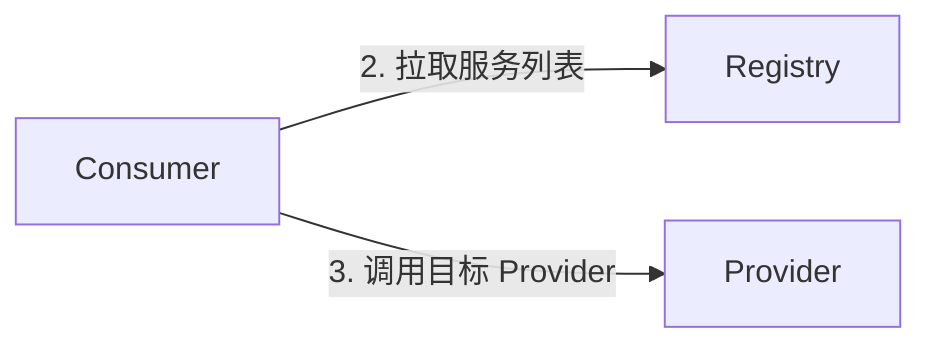
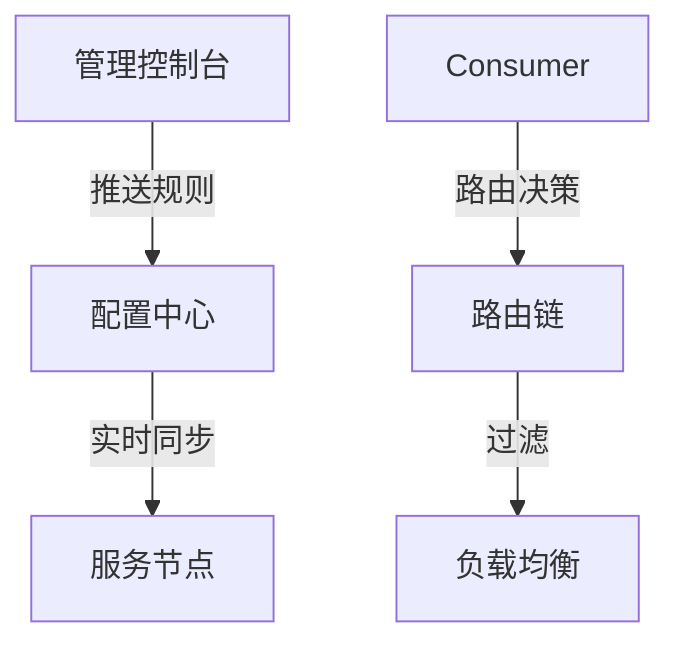

# Dubbo 面试之服务治理

## 服务注册和发现

### 【中等】什么是服务注册与发现？Dubbo 如何实现？

::: info 什么是服务注册与发现？
:::

服务注册与发现是微服务的核心基础设施，通过**解耦服务地址硬编码**，实现**动态扩缩容**和**故障自动恢复**。

- **服务注册（Registration）**：服务提供者（Provider）启动时，将自己的 **IP、端口、接口名** 等信息上报到**注册中心**（如 Zookeeper/Nacos）。**举例**：`订单服务`启动后，向注册中心注册：`"order-service: 192.168.1.100:8080"`。
- **服务发现（Discovery）**：服务消费者（Consumer）从注册中心 **拉取可用服务列表**，并基于负载均衡策略选择目标实例。**举例**：`支付服务`需要调用`订单服务`时，从注册中心获取所有可用的`order-service`节点列表。

**注册阶段**


**发现阶段**



::: info 有哪些常见的注册中心？
:::

**主流注册中心对比**

| **类型**   | **代表产品**          | **特点**                           |
| ---------- | --------------------- | ---------------------------------- |
| **CP 型**  | Zookeeper/Consul/Etcd | 强一致性，适合金融类业务           |
| **AP 型**  | Eureka                | 高可用优先，适合互联网场景         |
| **混合型** | Nacos                 | 可调整副本数、同步策略，来确立偏重 |

Dubbo 中可以通过 `registry` 配置来指定注册中心。

```xml
<!-- 服务提供者注册 -->
<dubbo:service interface="com.example.OrderService" ref="orderService" registry="zookeeper://127.0.0.1:2181"/>

<!-- 服务消费者发现 -->
<dubbo:reference id="orderService" interface="com.example.OrderService" registry="zookeeper://127.0.0.1:2181"/>
```

### 【简单】Dubbo 支持哪些注册中心？

不同于传统的 Dubbo2，Dubbo3 中定义了三种中心：注册中心、配置中心、元数据中心。配置中心、元数据中心是实现 Dubbo 高阶服务治理能力会依赖的组件，如流量管控规则等，相比于注册中心通常这两个组件的配置是可选的。

配置方式如下：

```yaml
dubbo
 registry
  address: nacos://localhost:8848
 config-center
  address: nacos://localhost:8848
 metadata-report
  address: nacos://localhost:8848
```

需要注意的是，**对于部分注册中心类型（如 Zookeeper、Nacos 等），Dubbo 会默认同时将其用作元数据中心和配置中心（建议保持默认开启状态）。**

Dubbo 目前支持的主流注册中心实现包括：

- Zookeeper
- Nacos
- Redis
- Consul
- Etcd
- 更多实现

同时也支持 Kubernetes、Mesh 体系的服务发现，具体请参考 [使用教程 - kubernetes 部署](http://localhost:1313/zh-cn/overview/mannual/java-sdk/tasks/deploy/)

### 【简单】注册中心挂了可以继续通信吗？

可以。Dubbo 消费者在应用启动时会从注册中心拉取已注册的生产者的地址接口，并缓存在本地。每次调用时，按照本地存储的地址进行调用。

### 【中等】注册中心是选择 CP 还是 AP？

::: info 什么是 CAP？
:::

在分布式系统领域，有一个著名的 [CAP 理论](https://en.wikipedia.org/wiki/CAP_theorem)。CAP 定理提出：分布式系统有三个指标，这三个指标不能同时做到：

- **一致性（Consistency）** - 在任何给定时间，网络中的所有节点都具有完全相同（最近）的值。
- **可用性（Availability）** - 对网络的每个请求都会返回响应，但不能保证返回的数据是最新的。
- **分区容错性（Partition Tolerance）** - 即使任意数量的节点出现故障，网络仍会继续运行。

CAP 就是取 Consistency、Availability、Partition Tolerance 的首字母而命名。


在分布式系统中，分区容错性是一个既定的事实：因为分布式系统总会出现各种各样的问题，如由于网络原因而导致节点失联；发生机器故障；机器重启或升级等等。因此，**CAP 定理实际上是要在可用性（A）和一致性（C）之间做权衡**。

::: info 注册中心选 AP 还是 CP？
:::

注册中心作为服务提供者和服务消费者之间沟通的桥梁，它的重要性不言而喻。所以注册中心一般都是采用集群部署来保证高可用性，并通过分布式一致性协议来确保集群中不同节点之间的数据保持一致。

根据 [CAP 理论](https://en.wikipedia.org/wiki/CAP_theorem)，三种特性无法同时达成，必须在可用性和一致性之间做取舍。于是，根据不同侧重点，注册中心可以分为 CP 和 AP 两个阵营：

- **CP 型注册中心** - **牺牲可用性来换取数据强一致性**，最典型的例子就是 ZooKeeper，etcd，Consul 了。ZooKeeper 集群内只有一个 Leader，而且在 Leader 无法使用的时候通过算法选举出一个新的 Leader。这个 Leader 的目的就是保证写信息的时候只向这个 Leader 写入，Leader 会同步信息到 Followers，这个过程就可以保证数据的强一致性。但如果多个 ZooKeeper 之间网络出现问题，造成出现多个 Leader，发生脑裂的话，注册中心就不可用了。而 etcd 和 Consul 集群内都是通过 Raft 协议来保证强一致性，如果出现脑裂的话， 注册中心也不可用。
- **AP 型注册中心** - **牺牲一致性（只保证最终一致性）来换取可用性**，最典型的例子就是 Eureka 了。Eureka 在设计的时候就是优先保证 A （可用性）。在 Eureka 中不存在什么 Leader 节点，每个节点都是一样的、平等的。因此 Eureka 不会像 ZooKeeper 那样出现选举过程中或者半数以上的机器不可用的时候服务就是不可用的情况。 Eureka 保证即使大部分节点挂掉也不会影响正常提供服务，只要有一个节点是可用的就行了。只不过这个节点上的数据可能并不是最新的。
- **CP & AP 都支持型注册中心** - Nacos 的内在设计偏向于 CP，即在发生网络分区的情况下优先保证数据的一致性和分区容错性，牺牲一定的可用性。虽然 Nacos 的内在设计偏向于 CP，但通过合理的配置与实践，可以在一定程度上优化其可用性。例如：调整副本数、配置同步策略。更多详情可以参考：[Nacos CAP](https://nacos.io/en/blog/faq/nacos-user-question-history10508/?spm=5238cd80.e9131ff.0.0.69845e2958zjvo&source=wuyi)

选择 CP 还是 AP，根据实际需要来定：如果业务场景要求强一致，优先选择 CP 型注册中心；如果业务场景强调可用性，优先选择 AP 型注册中心。

::: info 注册中心选型对比

:::

| 注册中心      | 特点                       | 适用场景                 |
| ------------- | -------------------------- | ------------------------ |
| **Zookeeper** | CP 系统，强一致性，高延迟  | 对一致性要求高的传统项目 |
| **Nacos**     | AP/CP 可切换，支持动态配置 | 云原生、微服务架构       |
| **Consul**    | 多数据中心，健康检查完善   | 跨机房服务发现           |

### 【中等】Dubbo 的服务自动上线与下线机制是怎样的？

::: info 服务自动上线流程

:::

- **启动注册**：
- 服务提供者启动时，解析配置文件（如 `dubbo:service` 或注解 `@Service`），获取服务接口、方法、版本、分组等信息。
  - 将服务元数据（如 IP、端口、接口名）注册到注册中心（如 Zookeeper/Nacos）。
  - 注册中心存储服务信息，形成服务目录（如 Zookeeper 的 `/dubbo/{service}/providers` 节点）。
- **消费者发现**：
  - 消费者启动时，从注册中心拉取服务提供者列表，并建立长连接。
  - 注册中心推送变更通知（如新服务上线），消费者动态更新本地服务列表。

::: info 服务自动下线流程

:::

- **主动下线**：
- 服务提供者正常关闭时，触发 Shutdown Hook，向注册中心发送注销请求。
  - 注册中心删除对应节点，消费者通过事件监听感知服务下线。
- **被动下线**：
  - **心跳检测**：若提供者宕机，注册中心未收到心跳（如 Zookeeper 的 Session 超时），自动剔除故障节点。
  - **消费者容错**：已连接的消费者通过故障处理机制（如 Failover）切换至其他可用节点。

::: info 关键保障机制

:::

- **心跳保活**：默认心跳间隔 60 秒（可调），超时时间建议 3 倍心跳间隔。
- **重试容错**：消费者支持 `retries` 配置（如 Failover 策略），避免单点故障。
- **优雅停机**：通过 `ProtocolConfig.destroy()` 确保注销完成后再终止 JVM。

::: info 高级治理能力

:::

- **版本灰度**：通过 `version` 字段实现多版本共存，逐步下线旧版本。
- **权重调整**：动态修改服务权重（如 Nacos 控制台），实现平滑流量迁移。
- **无损下线**：结合 QOS 命令（`offline`）或 PreStop Hook，确保流量完全迁移后再下线。

::: info 常见问题排查

:::

- **服务未注册**：

  - 检查注册中心地址、网络连通性。
  - 查看提供者日志是否有 `RegistryFailedException`。

- **僵尸节点**：

  - 手动清理注册中心残留节点（如 Zookeeper 的 `delete /dubbo/{service}/providers/xxx`）。
  - 调整心跳超时时间，避免因网络抖动误判。

- **消费者未感知下线**：
  - 确认注册中心支持事件推送（如 Nacos 的 `notify` 机制）。
  - 检查消费者是否配置了 `check=false`（禁用启动时强依赖检查）。

::: info 最佳实践

:::

- **生产环境建议**：
  - 使用 Nacos 作为注册中心，兼顾可用性和动态配置能力。
  - 开启 Dubbo Admin 监控，实时查看服务状态。
- **停机操作**：先通过 `telnet 127.0.0.1 20880` 执行 `invoke offline()` 命令，再重启服务。
- **版本迭代**：采用 `version="1.0.0"` 和 `group="canary"` 分批次上线，降低风险。

### 【困难】Dubbo3 的应用级服务发现的工作原理是什么？

**【应用级服务发现】是 Dubbo3 引入的新特性**，旨在解决大规模微服务架构下 **注册中心压力大** 和 **服务治理效率低** 的问题。其核心思想是 **以应用为维度注册实例**，而非传统接口级注册。

应用级注册通过 **注册与元数据分离**，将注册中心的数据量降低至常数级，显著提升了大规模微服务架构的可扩展性。其核心创新在于：

- **注册中心只存应用实例**，元数据独立存储；
- **消费者按需加载接口信息**，减少网络开销；
- **完美兼容旧模式**，支持渐进式迁移。

**与传统接口级注册的对比**

| **维度**         | **Dubbo2（接口级）**                                 | **Dubbo3（应用级）**                                |
| ---------------- | ---------------------------------------------------- | --------------------------------------------------- |
| **注册单位**     | 每个服务接口单独注册（如 `com.example.UserService`） | 整个应用的所有接口统一注册（如 `user-service-app`） |
| **注册数据量**   | 随接口数量线性增长（100 接口=100 条注册记录）        | 恒定（1 个应用=1 条注册记录）                       |
| **服务发现粒度** | 接口级别                                             | 应用级别（消费者按需拉取接口元数据）                |

::: info 接口级服务发现工作原理

:::

Dubbo3 以前的版本采用的是接口级服务发现。


Provider 部署的应用中通常会有多个 Service，每个 service 都可能会有其独有的配置。Service 服务发布的过程，其实就是基于这个服务配置生成地址 URL 的过程，生成的地址数据如图所示。

注册中心的地址数据存储结构，以 Service 服务名为数据划分依据，将一个服务下的所有地址数据都作为子节点进行聚合，子节点的内容就是实际可访问的 ip 地址，也就是我们 Dubbo 中 URL，格式就是刚才 Provider 实例生成的。


这里把 URL 地址数据划分成了几份：

- **实例可访问地址**：主要信息包含 ip 和 port，消费端将基于这条数据生成 tcp 网络链接，作为后续 RPC 数据的传输载体。
- **RPC 元数据**：元数据用于定义和描述一次 RPC 请求。它可以分为两类：
  - **具体的 RPC 服务信息**：如版本号、分组以及方法相关信息；
  - **RPC 配置数据**：控制 RPC 调用的行为，同步 Provider 进程实例的状态（如超时时间、数据编码的序列化方式等）。
- **自定义元数据**：用户可任意扩展并添加自定义元数据。

综上，有以下结论：

1. 服务发现聚合的 key 就是 RPC 粒度的服务
2. 注册中心同步的数据不止包含地址，还包含了各种元数据以及配置
3. 得益于 1 与 2，Dubbo 实现了支持应用、RPC 服务、方法粒度的服务治理能力

这就是一直以来 Dubbo2 在易用性、服务治理功能性、可扩展性上强于很多服务框架的真正原因。


接口级注册的易用性是有代价的，它限制了整体架构的扩展性，在大规模 Dubbo 集群中尤为凸显。其突出问题如下：

- **注册中心集群容量会成为瓶颈**：由于所有的 URL 地址数据都被发送到注册中心，注册中心的存储容量达到上限，推送效率也随之下降。
- **消费端资源消耗较大**：在消费端，Dubbo2 框架常驻内存已超 40%，每次地址推送带来的 cpu 等资源消耗率也非常高，影响正常的业务调用。

为什么会出现这个问题？举例来说，假设有一个普通的 Dubbo Provider 应用，该应用内部定义有 10 个 RPC Service，应用被部署在 100 个机器实例上。这个应用在集群中产生的数据量将会是 `Service 数 * 机器实例数`，也就是 `10 * 100 = 1000` 条数据。数据会从两个维度放大：

- **从地址角度**。100 条唯一的实例地址，被放大 10 倍
- **从服务角度**。10 条唯一的服务元数据，被放大 100 倍

::: info 应用级服务发现工作原理

:::


**提供者服务注册**

- 启动时，应用（如 `user-service-app`）将所有服务接口的 **元数据**（方法列表、协议等）上报至 **元数据中心**（如 Nacos）。
- 仅将 **应用名+实例 IP+端口** 注册到 **注册中心**（如 ZooKeeper），**不包含接口信息**。

**消费者服务发现**

- **订阅目标应用**：
  - 消费者（如 `order-service-app`）从注册中心获取目标应用（如 `user-service-app`）的 **实例列表**（IP+端口）。
  - **不直接获取接口信息**，避免注册中心数据膨胀。
- **按需拉取元数据**：
  - 消费者首次调用前，从 **元数据中心** 拉取目标应用的接口元数据（如 `UserService` 的方法签名）。
  - 本地缓存元数据，后续调用直接使用。

**调用过程**

- 消费者通过 **应用名+接口名** 定位实例，发起 RPC 调用（协议兼容 Dubbo2）。
- 负载均衡在应用实例级别进行（如随机选择 `user-service-app` 的一个实例）。

**关键设计优势**

- **注册中心轻量化**：实例数从 `O（接口数×实例数）` 降至 `O（实例数）`，适合万级节点集群。
- **动态扩容高效**：新增接口无需重复注册，只需更新元数据中心。
- **兼容性保障**：支持与 Dubbo2 的接口级注册共存，平滑升级。

> 扩展：[Dubbo3 应用级服务发现设计](https://cn.dubbo.apache.org/zh-cn/blog/2023/01/30/dubbo3-%E5%BA%94%E7%94%A8%E7%BA%A7%E6%9C%8D%E5%8A%A1%E5%8F%91%E7%8E%B0%E8%AE%BE%E8%AE%A1/)

## 负载均衡

### 【中等】Dubbo 支持哪些负载均衡方式？各有什么利弊？

Dubbo 提供了多种均衡策略，缺省为 `weighted random` 基于权重的随机负载均衡策略。

具体实现上，Dubbo 提供的是客户端负载均衡，即由 Consumer 通过负载均衡算法得出需要将请求提交到哪个 Provider 实例。

目前 Dubbo 内置了如下负载均衡算法，可通过调整配置项启用。

| 算法             | 算法类型                | 说明                                                 |
| :--------------- | :---------------------- | :--------------------------------------------------- |
| Random           | 加权随机                | 默认算法，默认权重相同                               |
| RoundRobin       | 加权轮询                | 借鉴于 Nginx 的平滑加权轮询算法，默认权重相同，      |
| LeastActive      | 最少活跃优先 + 加权随机 | 背后是能者多劳的思想                                 |
| ShortestResponse | 最短响应优先 + 加权随机 | 更加关注响应速度                                     |
| ConsistentHash   | 一致性哈希              | 确定的入参，确定的提供者，适用于有状态请求           |
| P2C              | Power of Two Choice     | 随机选择两个节点后，继续选择“连接数”较小的那个节点。 |
| Adaptive         | 自适应负载均衡          | 在 P2C 算法基础上，选择二者中 load 最小的那个节点    |

Dubbo 的负载均衡配置可以细粒度到服务、方法级别，且 `dubbo:service` 和 `dubbo:reference` 均可配置。

```xml
<!-- 服务端服务级别 -->
<dubbo:service interface="..." loadbalance="roundrobin" />
<!-- 客户端服务级别 -->
<dubbo:reference interface="..." loadbalance="roundrobin" />
<!-- 服务端方法级别 -->
<dubbo:service interface="...">
    <dubbo:method name="..." loadbalance="roundrobin"/>
</dubbo:service>
<!-- 客户端方法级别 -->
<dubbo:reference interface="...">
    <dubbo:method name="..." loadbalance="roundrobin"/>
</dubbo:reference>
```

::: info Random（随机）

:::

- **加权随机**，按权重设置随机概率。
- 在一个截面上碰撞的概率高，但调用量越大分布越均匀，而且按概率使用权重后也比较均匀，有利于动态调整提供者权重。
- 缺点：存在慢的提供者累积请求的问题，比如：第二台机器很慢，但没挂，当请求调到第二台时就卡在那，久而久之，所有请求都卡在调到第二台上。

::: info RoundRobin（轮询）

:::

- **加权轮询**，按公约后的权重设置轮询比率，循环调用节点
- 缺点：同样存在慢的提供者累积请求的问题。

::: info LeastActive（最少活跃优先）

:::

- **加权最少活跃调用优先**，活跃数越低，越优先调用，相同活跃数的进行加权随机。活跃数指调用前后计数差（针对特定提供者：请求发送数 - 响应返回数），表示特定提供者的任务堆积量，活跃数越低，代表该提供者处理能力越强。
- 使慢的提供者收到更少请求，因为越慢的提供者的调用前后计数差会越大；相对的，处理能力越强的节点，处理更多的请求。

::: info ShortestResponse（最短响应优先）
:::

- **加权最短响应优先**，在最近一个滑动窗口中，响应时间越短，越优先调用。相同响应时间的进行加权随机。
- 使得响应时间越快的提供者，处理更多的请求。
- 缺点：可能会造成流量过于集中于高性能节点的问题。

这里的响应时间 = 某个提供者在窗口时间内的平均响应时间，窗口时间默认是 30s。

::: info ConsistentHash（一致性 Hash）
:::

- **一致性 Hash**，相同参数的请求总是发到同一提供者。
- 当某一台提供者挂时，原本发往该提供者的请求，基于虚拟节点，平摊到其它提供者，不会引起剧烈变动。
- 算法参见：[Consistent Hashing | WIKIPEDIA](http://en.wikipedia.org/wiki/Consistent_hashing)
- 缺省只对第一个参数 Hash，如果要修改，请配置 `<dubbo:parameter key="hash.arguments" value="0,1" />`
- 缺省用 160 份虚拟节点，如果要修改，请配置 `<dubbo:parameter key="hash.nodes" value="320" />`

::: info P2C
:::

Power of Two Choice 算法简单但是经典，主要思路如下：

1. 对于每次调用，从可用的 provider 列表中做两次随机选择，选出两个节点 providerA 和 providerB。
2. 比较 providerA 和 providerB 两个节点，选择其“当前正在处理的连接数”较小的那个节点。

以下是 [Dubbo P2C 算法实现提案](https://cn.dubbo.apache.org/zh-cn/overview/reference/proposals/heuristic-flow-control/#p2c%20%E7%AE%97%E6%B3%95)

::: info Adaptive（自适应）
:::

Adaptive 即自适应负载均衡，是一种能根据后端实例负载自动调整流量分布的算法实现，它总是尝试将请求转发到负载最小的节点。

以下是 [Dubbo Adaptive 算法实现提案](https://cn.dubbo.apache.org/zh-cn/overview/reference/proposals/heuristic-flow-control/#adaptive%E7%AE%97%E6%B3%95)

> 扩展：
>
> - [Dubbo 官方文档之负载均衡](https://cn.dubbo.apache.org/zh-cn/overview/what/core-features/load-balance/)
> - [负载均衡](https://dunwu.github.io/waterdrop/pages/6da58e4b/)

## 服务路由

### 【中等】Dubbo 如何进行服务路由控制？

**路由规则**

| 策略类型     | 配置方式             | 匹配维度                 | 适用场景                |
| :----------- | :------------------- | :----------------------- | :---------------------- |
| **条件路由** | DSL 表达式/IP 段匹配 | 方法名、参数、来源 IP    | 灰度发布、环境隔离      |
| **标签路由** | 实例元数据标记       | 逻辑分组（如地域、版本） | 金丝雀发布、A/B 测试    |
| **脚本路由** | Groovy/JS 脚本       | 复杂业务逻辑             | 动态分流（如 VIP 用户） |

**配置方案**

**条件路由强化**

```yaml
# 多条件组合路由（支持&&,||,! 运算符）
conditions:
  - 'method=createOrder && userLevel=VIP => 192.168.1.100'
  - 'headers.appVersion=3.2.* => region=hangzhou'
```

**动态生效技巧**：通过`force:false`实现软路由，当目标节点不可用时自动降级

**标签路由进阶**

```java
// 编程式打标（配合配置中心）
RpcContext.getContext().setAttachment("traffic-tag", "experimental");
```

**最佳实践**：建立标签命名规范（如`env=prod`、`version=2.0`）

**架构图**



**动态管控**

- **规则存储**：建议使用 Nacos/Apollo 替代 Zookeeper，支持规则版本回溯
- **实时生效**：消费者节点秒级感知（长连接推送）
- **兜底策略**：本地缓存最后有效规则，避免配置中心不可用

**生产级解决方案**

**场景：跨机房流量调度**

```yaml
# 基于地域标签的路由
tags:
  - name: 'region=shanghai'
    addresses: ['10.1.1.1-10.1.1.20']
  - name: 'region=beijing'
    addresses: ['10.2.1.1-10.2.1.20']
rules:
  - '=> region=shanghai' # 默认路由
  - 'headers.forceZone=beijing => region=beijing'
```

**性能优化**：

- 路由缓存：本地缓存路由决策结果（TTL 5s）
- 预计算：在服务目录更新时提前生成路由快照

**异常处理机制**

```java
// 自定义路由失败处理器
public class CustomRouterFailover implements RouterListener {
    @Override
    public void onRouteFail(Invoker<?> invoker) {
        Metrics.counter("route_fail").increment();
        // 自动切换备用集群。..
    }
}
```

**监控指标设计**

| 指标名称     | 采集方式            | 告警阈值         |
| ------------ | ------------------- | ---------------- |
| 路由命中率   | 采样统计（每 1min） | <95% 触发警告    |
| 规则变更频率 | 配置中心事件监听    | >5 次/分钟告警   |
| 跨域调用比例 | 标签路由计数器      | 超出预设范围报警 |

**与治理功能联动**

- **负载均衡**：路由结果作为 LB 的优先权重依据
- **限流**：按路由维度设置独立限流规则
- **熔断**：路由异常节点自动加入熔断黑名单

**实施建议**：

- 先通过`<dubbo:parameter key="router" value="tag" />`启用基础路由
- 使用 Arthas 的`watch`命令实时观察路由决策过程
- 在预发布环境进行规则压测（模拟 1000 次/秒规则变更）

### 【中等】Dubbo 路由是怎样工作的？

以下是 Dubbo 单个路由器的工作过程，路由器接收一个服务的实例地址集合作为输入，基于请求上下文 (Request Context) 和 (Router Rule) 实际的路由规则定义对输入地址进行匹配，所有匹配成功的实例组成一个地址子集，最终地址子集作为输出结果继续交给下一个路由器或者负载均衡组件处理。


通常，在 Dubbo 中，多个路由器组成一条路由链共同协作，前一个路由器的输出作为另一个路由器的输入，经过层层路由规则筛选后，最终生成有效的地址集合。

- Dubbo 中的每个服务都有一条完全独立的路由链，每个服务的路由链组成可能不通，处理的规则各异，各个服务间互不影响。
- 对单条路由链而言，即使每次输入的地址集合相同，根据每次请求上下文的不同，生成的地址子集结果也可能不同。


### 【中等】Dubbo 支持哪些路由方式？分别适用于什么场景？

Dubbo 的路由规则可以基于应用、服务、方法、参数等粒度精准的控制请求分发，根据请求的目标服务、方法以及请求体中的其他附加参数进行匹配，符合匹配条件的请求会进一步的按照特定规则转发到一个地址子集。

Dubbo 支持以下路由规则：

- 标签路由规则
- 条件路由规则
- 脚本路由规则
- 动态配置规则

::: info 标签路由规则

:::

**标签路由**通过将某一个服务的实例划分到不同的**分组**，**约束具有特定标签的流量只能在指定分组中流转**，不同分组为不同的流量场景服务，从而实现流量隔离的目的。**标签路由可以作为蓝绿发布、灰度发布等场景能力的基础**。

标签路由规则是一个非此即彼的流量隔离方案，也就是匹配标签的请求会 100% 转发到有相同标签的实例，没有匹配标签的请求会 100% 转发到其余未匹配的实例。如果您需要按比例的流量调度方案，请参考示例 [基于权重的按比例流量路由](https://cn.dubbo.apache.org/zh-cn/overview/what/core-features/tasks/traffic-management/weight/)。

**标签主要是指对 Provider 端应用实例的分组**，目前有两种方式可以完成实例分组，分别是动态规则打标和静态规则打标。**动态规则打标**可以在运行时动态的圈住一组机器实例，而**静态规则打标**则需要实例重启后才能生效，其中，动态规则相较于静态规则优先级更高，而当两种规则同时存在且出现冲突时，将以动态规则为准。

::: info 条件路由规则

:::

条件路由与标签路由的工作模式非常相似，也是首先对请求中的参数进行匹配，**符合匹配条件的请求将被转发到包含特定实例地址列表的子集**。相比于标签路由，条件路由的匹配方式更灵活：

- 在标签路由中，一旦给某一台或几台机器实例打了标签，则这部分实例就会被立马从通用流量集合中移除，不同标签之间不会再有交集。有点类似下图，地址集合在输入阶段就已经划分明确。


- 而从条件路由的视角，所有的实例都是一致的，路由过程中不存在分组隔离的问题，每次路由过滤都是基于全量地址中执行


条件路由规则的主体 `conditions` 主要包含两部分内容：

- => 之前的为请求参数匹配条件，指定的**匹配条件指定的参数**将与**消费者的请求上下文 (URL)**、甚至**方法参数**进行对比，当消费者满足匹配条件时，对该消费者执行后面的地址子集过滤规则。
- => 之后的为地址子集过滤条件，指定的**过滤条件指定的参数**将与**提供者实例地址 (URL) **进行对比，消费者最终只能拿到符合过滤条件的实例列表，从而确保流量只会发送到符合条件的地址子集。
  - 如果匹配条件为空，表示对所有请求生效，如：`=> status != staging`
  - 如果过滤条件为空，表示禁止来自相应请求的访问，如：`application = product =>`

::: info 脚本路由规则

:::

脚本路由是最直观的路由方式，同时它也是当前最灵活的路由规则，因为你可以在脚本中定义任意的地址筛选规则。如果我们为某个服务定义一条脚本规则，则后续所有请求都会先执行一遍这个脚本，脚本过滤出来的地址即为请求允许发送到的、有效的地址集合。

```yaml
configVersion: v3.0
key: demo-provider
type: javascript
enabled: true
script: |
  (function route(invokers,invocation,context) {
      var result = new java.util.ArrayList(invokers.size());
      for (i = 0; i < invokers.size(); i ++) {
          if ("10.20.3.3".equals(invokers.get(i).getUrl().getHost())) {
              result.add(invokers.get(i));
          }
      }
      return result;
  } (invokers, invocation, context)); // 表示立即执行方法
```

::: info 动态配置规则

:::

通过 Dubbo 提供的动态配置规则，可以动态的修改 Dubbo 服务进程的运行时行为，整个过程不需要重启，配置参数实时生效。基于这个强大的功能，基本上所有运行期参数都可以动态调整，比如超时时间、临时开启 Access Log、修改 Tracing 采样率、调整限流降级参数、负载均衡、线程池配置、日志等级、给机器实例动态打标签等。与上文讲到的流量管控规则类似，动态配置规则支持应用、服务两个粒度，也就是说一次可以选择只调整应用中的某一个或几个服务的参数配置。

当然，出于系统稳定性、安全性的考量，有些特定的参数是不允许动态修改的，但除此之外，基本上所有参数都允许动态修改，很多强大的运行态能力都可以通过这个规则实现。通常 URL 地址中的参数均可以修改，这在每个语言实现的参考手册里也记录了一些更详细的说明。

### 【中等】如何在 Dubbo 中使用直连提供者？

**核心配置方式**

- **XML 配置**

```xml
<dubbo:reference
    id="myService"
    interface="com.example.MyService"
    url="dubbo://192.168.1.100:20880/com.example.MyService"/>
```

- **注解配置**

```java
@Reference(url = "dubbo://192.168.1.100:20880/com.example.MyService")
private MyService myService;
```

**关键特性**

| 特性             | 说明                                     |
| ---------------- | ---------------------------------------- |
| **协议格式**     | `dubbo://IP:PORT/接口全限定名`           |
| **绕过注册中心** | 直接连接指定服务节点，避免注册中心复杂度 |
| **即时生效**     | 配置修改后无需重启服务                   |

**适用场景**

- **开发调试**：快速连接本地/测试环境服务
- **问题排查**：临时绕过注册中心验证服务可用性
- **单元测试**：固定服务端点保证测试稳定性

**注意事项**

- **生产环境风险**
  - 丧失服务发现能力（无法自动感知节点上下线）
  - 缺少负载均衡和熔断机制
  - 配置维护成本高（需手动管理所有节点地址）
- **安全建议**

  - 限制直连 IP 白名单
  - 避免在配置文件中硬编码地址（建议使用环境变量）

  ```xml
  <dubbo:reference url="dubbo://${PROVIDER_IP}:20880/com.example.MyService"/>
  ```

**调试技巧**

- **动态切换**：通过 JVM 参数临时启用直连

```
-Dcom.example.MyService.url=dubbo://127.0.0.1:20880
```

- **组合使用**：保留注册中心配置，通过`url`属性覆盖特定服务

```xml
<dubbo:registry address="nacos://localhost:8848"/>
<dubbo:reference url="dubbo://192.168.1.100:20880" interface="com.example.MyService"/>
```

> **最佳实践**：建议仅在非生产环境使用直连模式，生产环境应通过注册中心实现服务发现和治理。

## 流量控制

### 【中等】Dubbo 中的流量控制策略有哪些？

流量控制策略主要包括：限流、熔断、降级

Dubbo 中，可以通过集成 Hystrix 或 Sentinel 来实现限流、熔断、降级。

### 【中等】什么是 Dubbo 的 Mock 机制？如何使用？

Dubbo 的 Mock 机制是一种用于服务降级的功能。当远程调用失败或不稳定时，通过 Mock 机制可以返回预先定义的结果，从而保证服务的可用性。

除了 Dubbo，很多分布式框架和微服务架构都会提供类似的服务降级功能。比如 Spring Cloud 里面的 Hystrix，可以通过配置降级策略，在服务异常时返回降级数据。

**配置方式**

| 类型            | 实现方式        | 示例                                                            |
| :-------------- | :-------------- | :-------------------------------------------------------------- |
| **全局配置**    | XML 配置        | `<dubbo:reference mock="true" interface="com.xx.DemoService"/>` |
| **注解配置**    | @Reference 注解 | `@Reference(mock = "true") private DemoService demoService;`    |
| **自定义 Mock** | 实现 Mock 类    | 略                                                              |

**高级配置**

- **强制 Mock**：`mock="force:return empty"`（直接返回 Mock 结果）
- **失败 Mock**：`mock="fail:return null"`（仅调用失败时生效）
- **方法级 Mock**：`mock="return {methodName}"`（指定方法 Mock）

**典型应用场景**

- **容灾场景**：网络故障/服务不可用时的兜底方案
- **开发测试**：解耦依赖服务，提升开发效率
- **性能保障**：非核心服务降级，保障核心链路

**注意事项**

- **生产环境建议**：
  - 配合超时配置使用：`<dubbo:reference timeout="3000" mock="true"/>`
  - 避免写操作接口使用 Mock
- **性能影响**：
  - Mock 类应保持简单逻辑
  - 复杂 Mock 可能成为性能瓶颈

**与其他方案对比**

| 方案           | 触发条件   | 粒度   | 实现复杂度 |
| -------------- | ---------- | ------ | ---------- |
| **Dubbo Mock** | 调用失败   | 方法级 | 低         |
| **熔断器**     | 错误率阈值 | 服务级 | 中         |
| **限流**       | 流量阈值   | 系统级 | 高         |

## 故障处理

### 【中等】如何在 Dubbo 中使用健康检查？

Dubbo 通过 **多级健康检查机制** 保障服务可用性，开发者可根据业务需求选择默认配置或扩展自定义检查逻辑。

**健康检查方式**

| **类型**           | **触发条件**                         | **适用场景**                    | **配置示例**                                |
| ------------------ | ------------------------------------ | ------------------------------- | ------------------------------------------- |
| **服务提供者探活** | 定时心跳检测（默认 3 秒）            | 快速发现宕机节点                | `<dubbo:provider heartbeat="5000"/>`        |
| **注册中心剔除**   | 长连接断开后自动摘除（如 Zookeeper） | 防止调用失效节点                | 无需配置，依赖注册中心能力                  |
| **接口级检查**     | 自定义`HealthCheck`接口实现          | 精细化业务健康状态（如依赖 DB） | 实现`org.apache.dubbo.health.HealthChecker` |

**关键配置参数**

```xml
<!-- 服务端配置示例 -->
<dubbo:provider
    heartbeat="3000"                 <!-- 心跳间隔（毫秒） -->
    heartbeat-timeout="60000"        <!-- 超时剔除时间 -->
    checks="true"                    <!-- 开启消费者检查（默认 true） -->
/>

<!-- 客户端配置示例 -->
<dubbo:consumer
    check="false"                    <!-- 启动时不强制检查提供者（默认为 true 阻塞启动） -->
    stale-check="true"               <!-- 启用陈旧节点检查 -->
/>
```

**自定义健康检查（高级）**

**步骤**：

1. 实现`HealthChecker`接口：

   ```java
   public class DbHealthChecker implements HealthChecker {
       @Override
       public boolean isHealthy() {
           return checkDatabaseConnection(); // 自定义检查逻辑
       }
   }
   ```

2. SPI 注册（在`META-INF/dubbo/org.apache.dubbo.health.HealthChecker`文件添加）：

   ```properties
   dbHealth=com.example.DbHealthChecker
   ```

**监控与运维建议**

- **日志监控**：关注`HeartbeatFailedEvent`告警日志
- **组合策略**：
  - 生产环境建议同时启用 **心跳检测** + **注册中心剔除**
  - 关键服务补充 **接口级检查**（如数据库/缓存连接）
- **压测注意**：高频心跳可能增加注册中心负载，需调整`heartbeat`参数平衡敏感度与性能

### 【中等】Dubbo 有哪些集群容错策略？

在集群调用失败时，Dubbo 提供了多种容错方案，缺省为 failover 重试。


图中节点关系说明：

- 这里的 `Invoker` 是 `Provider` 的一个可调用 `Service` 的抽象，`Invoker` 封装了 `Provider` 地址及 `Service` 接口信息
- `Directory` 代表多个 `Invoker`，可以把它看成 `List<Invoker>` ，但与 `List` 不同的是，它的值可能是动态变化的，比如注册中心推送变更
- `Cluster` 将 `Directory` 中的多个 `Invoker` 伪装成一个 `Invoker`，对上层透明，伪装过程包含了容错逻辑，调用失败后，重试另一个
- `Router` 负责从多个 `Invoker` 中按路由规则选出子集，比如读写分离，应用隔离等
- `LoadBalance` 负责从多个 `Invoker` 中选出具体的一个用于本次调用，选的过程包含了负载均衡算法，调用失败后，需要重选

Dubbo 支持的容错策略：

- **Failover** - **失败自动切换**。当出现失败，重试其它服务器。通常用于读操作，但重试会带来更长延迟。可通过 `retries="2"` 来设置重试次数（不含第一次）。
- **Failfast** - **快速失败**。只发起一次调用，失败立即报错。通常用于非幂等性的写操作，比如新增记录。
- **Failsafe** - **失败安全**。出现异常时，直接忽略。通常用于写入审计日志等操作。
- **Failback** - **失败自动恢复**。后台记录失败请求，定时重发。通常用于消息通知操作。
- **Forking** - **并行调用多个服务器**。只要一个成功即返回。通常用于实时性要求较高的读操作，但需要浪费更多服务资源。可通过 `forks="2"` 来设置最大并行数。
- **Broadcast** - **广播调用所有提供者**。逐个调用，任意一台报错则报错。通常用于通知所有提供者更新缓存或日志等本地资源信息。

集群容错配置示例：

```xml
<dubbo:service cluster="failsafe" />
<dubbo:reference cluster="failsafe" />
```

## 可观测

### 【中等】Dubbo 提供了哪些监控能力？

Dubbo 内部维护了多个纬度的可观测指标，并且支持多种方式的可视化监测。可观测性指标从总体上来说分为三个度量纬度：

- **Admin** - Admin 控制台可视化展示了集群中的应用、服务、实例及依赖关系，支持流量治理规则下发，同时还提供如服务测试、mock、文档管理等提升研发测试效率的工具。
- **Metrics** - Dubbo 统计了一系列的流量指标如 QPS、RT、成功请求数、失败请求数等，还包括一系列的内部组件状态如线程池数、服务健康状态等。
- **Tracing** - Dubbo 与业界主流的链路追踪工作做了适配，包括 Skywalking、Zipkin、Jaeger 都支持 Dubbo 服务的链路追踪。
- **Logging** - Dubbo 支持多种日志框架适配。以 Java 体系为例，支持包括 Slf4j、Log4j2、Log4j、Logback、Jcl 等，用户可以基于业务需要选择合适的框架；同时 Dubbo 还支持 Access Log 记录请求踪迹。

### 【中等】Dubbo 的 Monitor 是如何工作的？

Dubbo Monitor 在设计上兼顾低侵入性、高性能、实时性。

**核心职责**

- **数据采集**：通过`MonitorFilter`拦截每次服务调用，记录：调用次数、调用时间、耗时、成功数、失败数、异常等信息。
- **数据上报**：采用非阻塞方式上报统计信息到监控中心，避免影响业务性能。
- **存储和分析**：监控中心可以是第三方监控系统，如：Zabbix、Prometheus 或 Dubbo 内置的轻量级实现，持久化存储数据。
- **可视化**：可视化可以选择 Dubbo 提供的轻量级实现 Dubbo Admin，也可以集成第三方可视化 Dashboard。

**关键组件**

- **MonitorFilter**
  - **调用前**：记录开始时间。
  - **调用后**：计算耗时，封装监控数据（成功/失败状态）。
  - **上报**：通过`MonitorProtocol`异步发送数据。
- **MonitorProtocol**：专为监控设计的轻量协议，支持批量上报，降低网络开销。

**高可用与扩展**

- **多实例部署**：监控中心集群化，避免单点故障。
- **弹性扩展**：采用分布式存储（如 ES、时序数据库）应对高流量。

**监控数据流**

```
服务调用 → MonitorFilter 拦截 → 记录指标 → 异步上报 → Monitor 中心 → 存储 → 可视化
```

### 【困难】如何在 Dubbo 中处理服务调用链路追踪？

**核心实现步骤**

1. **集成追踪框架**

   - 选择 SkyWalking/Zipkin/Jaeger 等工具

- 添加对应依赖（如`skywalking-agent.jar`）

2. **配置 Dubbo 过滤器**

   ```xml
   <!-- 全局启用追踪过滤器 -->
   <dubbo:provider filter="tracingFilter"/>
   <dubbo:consumer filter="tracingFilter"/>
   ```

3. **实现追踪过滤器**

   ```java
   @Activate(group = {PROVIDER, CONSUMER})
   public class TracingFilter implements Filter {
       @Override
       public Result invoke(Invoker<?> invoker, Invocation inv) throws RpcException {
           // 1. 从 invocation 获取/生成 TraceID
           String traceId = getOrCreateTraceId(inv);

           // 2. 记录开始时间（RPC 上下文/ThreadLocal）
           long start = System.currentTimeMillis();

           try {
               // 3. 传递追踪上下文（通过 RpcContext）
               RpcContext.getContext().setAttachment("traceId", traceId);

               // 4. 执行实际调用
               return invoker.invoke(inv);
           } finally {
               // 5. 上报追踪数据
               report(traceId, inv, start);
           }
       }
   }
   ```

**关键设计要点**

1. **上下文传播**

   - 通过`RpcContext`传递`TraceID`和`SpanID`
   - 跨服务时自动携带 HTTP Headers/Dubbo Attachments

2. **异步上报**

   ```java
   // 示例：使用异步线程池上报
   executor.submit(() -> {
       tracer.report(new Span(traceId, duration));
   });
   ```

3. **采样控制**

   ```properties
   # 在配置文件中控制采样率
   dubbo.tracing.sample-rate=0.1
   ```

**主流方案对比**

| 框架       | 数据存储        | 可视化    | 特点                      |
| ---------- | --------------- | --------- | ------------------------- |
| SkyWalking | ES/H2           | 原生 UI   | 零侵入、APM 集成度高      |
| Zipkin     | Cassandra/ES    | Zipkin UI | 轻量级、部署简单          |
| Jaeger     | Cassandra/Kafka | Jaeger UI | Uber 开源、支持大规模集群 |

**生产建议**

1. **性能优化**

   - 采用异步批量上报（如 Jaeger 的 gRPC reporter）
   - 对高频服务启用采样（1%~10%）

2. **异常处理**

   ```java
   try {
       return invoker.invoke(inv);
   } catch (Exception e) {
       // 标记错误 span
       span.tag("error", e.getMessage());
       throw e;
   }
   ```

3. **扩展功能**

   ```java
   // 添加自定义标签
   span.tag("region", "north-1");
   // 记录业务指标
   span.log("order_amount", 100);
   ```

> **注**：新版 Dubbo 已内置 Tracing 支持，可通过`dubbo-spring-boot-starter`快速集成，推荐优先使用官方方案。

## 参考资料

- [Dubbo Github](https://github.com/apache/dubbo)
- [Dubbo 官方文档](https://dubbo.apache.org/zh-cn/)
- [Dubbo 框架设计](https://cn.dubbo.apache.org/zh-cn/docsv2.7/dev/design/)
- [如何基于 Dubbo 进行服务治理、服务降级、失败重试以及超时重试？](https://github.com/doocs/advanced-java/blob/master/docs/distributed-system/dubbo-service-management.md)