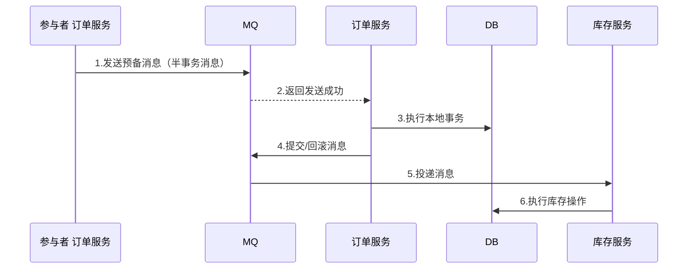
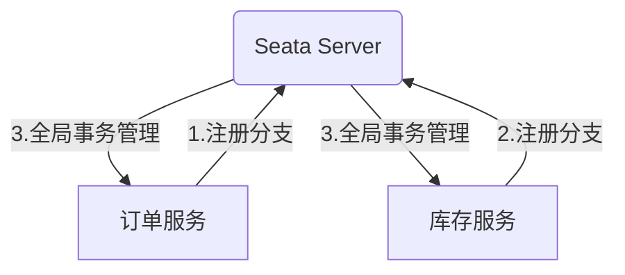

# Dubbo 面试之架构

## 调用流程

### 【简单】Dubbo 支持哪些序列化方式？

- **Hessian（默认）**
  - **特点**：二进制格式，速度较快，体积较小
  - **适用场景**：通用 RPC 调用（Dubbo 默认方案）
  - **缺点**：对复杂对象支持有限
- **JSON**
  - **特点**：文本格式，可读性强，跨语言支持好
  - **适用场景**：前后端交互、多语言系统
  - **缺点**：性能较差，数据体积大
- **Java 原生序列化**
  - **特点**：JDK 内置，使用简单
  - **适用场景**：Java 单体应用调试
  - **缺点**：性能差，体积大，仅限 Java
- **Kryo**
  - **特点**：高性能二进制，速度极快，体积小
  - **适用场景**：高并发、低延迟场景
  - **缺点**：API 复杂，需注册类
- **Protobuf（推荐）**
  - **特点**：Google 出品，高效跨语言，可扩展
  - **适用场景**：微服务跨语言通信
  - **缺点**：需预定义。proto 文件
- **FST**
  - **特点**：类似 Kryo，高性能二进制
  - **适用场景**：替代 Hessian 的高性能需求
  - **缺点**：兼容性较弱

**选型建议**

| 序列化方式   | 性能 | 体积 | 跨语言 | 易用性 | 适用场景              |
| ------------ | ---- | ---- | ------ | ------ | --------------------- |
| **Hessian**  | 中   | 小   | 部分   | 高     | 默认 RPC 调用         |
| **JSON**     | 低   | 大   | 是     | 高     | 前后端交互            |
| **Java**     | 低   | 大   | 否     | 高     | 调试/兼容旧系统       |
| **Kryo**     | 高   | 小   | 否     | 中     | 纯 Java 高性能场景    |
| **Protobuf** | 高   | 小   | 是     | 中     | 跨语言微服务（推荐）  |
| **FST**      | 高   | 小   | 否     | 中     | 替代 Hessian 优化性能 |

**推荐选择**

- **默认场景** → Hessian
- **跨语言微服务** → Protobuf
- **纯 Java 高性能** → Kryo/FST
- **调试/兼容** → Java 原生
- **前后端交互** → JSON

### 【简单】Dubbo 支持哪些通信协议？

Dubbo 框架提供了自定义的高性能 RPC 通信协议：基于 HTTP/2 的 Triple 协议 和 基于 TCP 的 Dubbo2 协议。除此之外，Dubbo 框架支持任意第三方通信协议，如官方支持的 gRPC、Thrift、REST、JsonRPC、Hessian2 等，更多协议可以通过自定义扩展实现。这对于微服务实践中经常要处理的多协议通信场景非常有用。

**Dubbo 框架不绑定任何通信协议，在实现上 Dubbo 对多协议的支持也非常灵活，它可以让你在一个应用内发布多个使用不同协议的服务，并且支持用同一个 port 端口对外发布所有协议。**


Dubbo 官方支持的协议如下：

- **HTTP/2 (Triple)** - Dubbo3 新增，基于 HTTP/2 并且完全兼容 gRPC 协议，原生支持 Streaming 通信语义，Triple 可同时运行在 HTTP/1 和 HTTP/2 传输协议之上，让你可以直接使用 curl、浏览器访问后端 Dubbo 服务。自 Triple 协议开始，Dubbo 还支持基于 Protocol Buffers 的服务定义与数据传输，但 Triple 实现并不绑定 IDL。Triple 具备更好的网关、代理穿透性，因此非常适合于跨网关、代理通信的部署架构，如服务网格等。更多详情见：Triple 协议详情见 [Triple 协议开发任务](https://cn.dubbo.apache.org/zh-cn/overview/what/tasks/protocols/triple/)、[Triple 设计思路与协议规范](https://cn.dubbo.apache.org/zh-cn/overview/reference/protocols/triple/)。
- **Dubbo2** - Dubbo2 协议是基于 TCP 传输层协议之上构建的一套 RPC 通信协议，具有紧凑、灵活、高性能等特点。它是 Dubbo 的默认通信协议，采用单一长连接和 NIO 异步通信，基于 hessian 作为序列化协议。Dubbo2 协议适合于小数据量大并发的服务调用，以及服务消费者机器数远大于服务提供者机器数的情况。反之，Dubbo 缺省协议不适合传送大数据量的服务，比如传文件，传视频等，除非请求量很低。Dubbo 协议详情见 [Dubbo2 协议开发任务](https://cn.dubbo.apache.org/zh-cn/overview/what/tasks/protocols/dubbo/)、[Dubbo2 设计思路与协议规范](https://cn.dubbo.apache.org/zh-cn/overview/reference/protocols/tcp/)。
- **gRPC** - gRPC 是谷歌开源的基于 HTTP/2 的通信协议。gRPC 的定位是通信协议与实现，是一款纯粹的 RPC 框架，而 Dubbo 定位是一款微服务框架，为微服务实践提供解决方案。在 Dubbo 体系下使用 gRPC 协议是一个非常高效和轻量的选择，它让你既能使用原生的 gRPC 协议通信，又避免了基于 gRPC 进行二次定制与开发的复杂度。gRPC 协议详情见 [gRPC over Dubbo 示例](https://cn.dubbo.apache.org/zh-cn/overview/what/tasks/protocols/grpc/)。
- **REST** - 微服务领域常用的一种通信模式是 HTTP + JSON，包括 Spring Cloud、Microprofile 等一些主流的微服务框架都默认使用的这种通信模式，Dubbo 同样提供了对基于 HTTP 的编程、通信模式的支持。REST 协议详情见 [HTTP over Dubbo 示例](https://cn.dubbo.apache.org/zh-cn/overview/what/tasks/protocols/web/)、[Dubbo 与 Spring Cloud 体系互通](https://cn.dubbo.apache.org/zh-cn/overview/what/tasks/protocols/springcloud/)。
- **Hessian** - [hessian](http://dubbo.apache.org/zh-cn/docs/user/references/protocol/hessian.html) 协议用于集成 Hessian 的服务，Hessian 底层采用 Http 通讯，采用 Servlet 暴露服务，Dubbo 缺省内嵌 Jetty 作为服务器实现。Dubbo 的 Hessian 协议可以和原生 Hessian 服务互操作，即：
  - 提供者用 Dubbo 的 Hessian 协议暴露服务，消费者直接用标准 Hessian 接口调用
  - 或者提供方用标准 Hessian 暴露服务，消费方用 Dubbo 的 Hessian 协议调用。
- **Thrift** - dubbo 支持的 [thrift](http://dubbo.apache.org/zh-cn/docs/user/references/protocol/thrift.html) 协议是对 thrift 原生协议的扩展，在原生协议的基础上添加了一些额外的头信息，比如 service name，magic number 等。使用 dubbo thrift 协议同样需要使用 thrift 的 idl compiler 编译生成相应的 java 代码。

扩展：[Dubbo 官方文档之通信协议](https://cn.dubbo.apache.org/zh-cn/overview/what/core-features/protocols/)

### 【困难】动态代理在 Dubbo 中有哪些应用？

Dubbo 广泛使用 **动态代理** 技术来实现 **远程调用（RPC）**、**延迟加载（Lazy Loading）** 和 **AOP 增强（如负载均衡、容错等）**，主要涉及 **JDK 动态代理** 和 **CGLIB** 两种方式。

**核心应用场景**

**（1）远程调用（RPC）**

Dubbo 的 **核心 RPC 调用** 依赖动态代理。**消费者（Consumer）** 调用服务时，Dubbo 生成一个 **代理对象**（`Proxy`），代理负责：

- **封装网络通信**（序列化/反序列化、TCP 传输）。
- **负载均衡**（从多个 Provider 中选择一个）。
- **容错机制**（失败重试、熔断降级）。

**示例代码**（消费者调用远程服务）：

```java
@Reference  // Dubbo 自动生成代理
private OrderService orderService;

public void createOrder() {
    orderService.create();  // 实际调用的是代理对象，代理处理远程通信
}
```

**底层实现**：

- 如果服务是 **接口** → 使用 **JDK 动态代理**（基于 `InvocationHandler`）。
- 如果服务是 **类**（无接口）→ 使用 **CGLIB** 生成子类代理。

**（2）延迟加载（Lazy Loading）**

Dubbo 支持 **懒初始化**，即服务 **首次调用时才实例化**，减少启动时间。

- **代理拦截**：Dubbo 返回代理对象，**真正调用时才初始化真实服务**。
- **适用场景**：初始化成本高的服务（如数据库连接、大数据计算）。

**配置方式**（XML/注解）：

```xml
<dubbo:service interface="com.example.UserService" lazy="true" />
```

或

```java
@Service
@org.apache.dubbo.config.annotation.Service(lazy = true)
public class UserServiceImpl implements UserService {}
```

**（3）AOP 增强（Filter 机制）**

Dubbo 的 **Filter 链**（如监控、日志、权限校验）基于动态代理实现：

- **代理包装真实服务**，在调用前后插入逻辑（类似 Spring AOP）。
- **示例**：
  - `MonitorFilter`：统计调用耗时。
  - `TokenFilter`：权限校验。

**实现方式**

```java
public class MyFilter implements Filter {
    @Override
    public Result invoke(Invoker<?> invoker, Invocation invocation) {
        System.out.println("Before RPC call");
        Result result = invoker.invoke(invocation);  // 真实调用
        System.out.println("After RPC call");
        return result;
    }
}
```

Dubbo 会通过 **代理机制** 自动应用这些 Filter。

2. JDK 动态代理 vs. CGLIB

| **对比项**   | **JDK 动态代理**                     | **CGLIB**           |
| ------------ | ------------------------------------ | ------------------- |
| **适用场景** | 代理接口（如 Dubbo 的 `@Reference`） | 代理类（无接口）    |
| **性能**     | 较快（基于反射）                     | 略慢（生成子类）    |
| **依赖**     | 无需额外库                           | 需引入 `cglib` 依赖 |
| **示例**     | `Proxy.newProxyInstance()`           | `Enhancer.create()` |

Dubbo **默认优先使用 JDK 动态代理**，如果目标类没有接口，则降级为 CGLIB。

**动态代理的底层实现**

**（1）JDK 动态代理（接口代理）**

```java
public class JdkProxyDemo {
    public static void main(String[] args) {
        OrderService proxy = (OrderService) Proxy.newProxyInstance(
            OrderService.class.getClassLoader(),
            new Class[]{OrderService.class},
            (proxyObj, method, args1) -> {
                System.out.println("Before method call");
                // 模拟远程调用
                Object result = "Mock Result";
                System.out.println("After method call");
                return result;
            }
        );
        proxy.createOrder();  // 调用代理方法
    }
}
```

**（2）CGLIB（类代理）**

```java
public class CglibProxyDemo {
    public static void main(String[] args) {
        Enhancer enhancer = new Enhancer();
        enhancer.setSuperclass(UserServiceImpl.class);
        enhancer.setCallback((MethodInterceptor) (obj, method, args1, proxy) -> {
            System.out.println("Before method call");
            Object result = proxy.invokeSuper(obj, args1);
            System.out.println("After method call");
            return result;
        });
        UserService proxy = (UserService) enhancer.create();
        proxy.getUser();  // 调用代理方法
    }
}
```

**总结**

| **应用场景**        | **动态代理的作用**             | **实现方式** |
| ------------------- | ------------------------------ | ------------ |
| **远程调用（RPC）** | 封装网络通信、负载均衡、容错   | JDK/CGLIB    |
| **延迟加载**        | 首次调用时才初始化服务         | JDK/CGLIB    |
| **AOP（Filter）**   | 实现日志、监控、权限等增强逻辑 | JDK/CGLIB    |

## 工作原理

### 【中等】Dubbo 的工作原理是什么？

Dubbo 通过 **注册中心解耦** + **动态代理透明化调用** + **集群容错保障可用性**，实现高效 RPC 通信。

**核心架构**

- **Provider**：暴露服务接口，注册到注册中心
- **Consumer**：从注册中心订阅服务，发起远程调用
- **Registry**：服务发现与元数据管理（如 Zookeeper/Nacos）
- **Monitor** ：统计调用次数和耗时

**调用流程**

1. **服务注册**：Provider 启动 → 注册服务到 Registry
2. **服务发现**：Consumer 启动 → 从 Registry 订阅 Provider 列表
3. **远程调用**：Consumer 通过 **动态代理** 发起调用 → 经负载均衡选择 Provider → 网络传输（Netty/HTTP）
4. **结果返回**：Provider 处理请求 → 返回结果给 Consumer

**关键机制**

- **动态代理**：生成接口代理类，屏蔽远程调用细节
- **负载均衡**：内置随机/轮询/最少活跃调用等算法
- **集群容错**：失败自动切换（Failover）/快速失败（Failfast）等策略
- **异步通信**：基于 Netty 的 NIO 长连接，支持异步调用
- **SPI 机制**：可插拔式扩展（如替换注册中心/协议）
- **Filter 链**：支持 AOP 式拦截（日志/限流/鉴权）

**性能优化设计**

- **元数据缓存**：Consumer 本地缓存 Provider 列表
- **长连接复用**：减少 TCP 握手开销
- **线程池隔离**：业务逻辑与 IO 线程分离

### 【简单】Dubbo 有哪些核心组件？


Dubbo 是一个高性能分布式服务框架，它有**三个核心组件**：

- **Provider**：服务提供者。
  - 启动时，向注册中心注册自己提供的服务。
  - 接收 Consumer 的远程调用请求并返回结果。
- **Consumer**：服务消费者。
  - 启动时，向注册中心订阅自己所需的服务，获取 Provider 地址列表。
  - 通过负载均衡策略选择 Provider 发起远程调用。
- **Registry**：注册中心。
  - 负责服务的注册与发现（如 Zookeeper、Nacos）。
  - 动态维护 Provider 和 Consumer 的映射关系。

**扩展组件**

- **Monitor**：监控中心。统计服务调用次数、耗时、成功率等指标，便于运维和优化。
- **Container**：服务容器。管理服务生命周期（如 Spring 容器），提供依赖注入和环境支持。
- **Protocol**：通信协议。定义数据传输方式（如 Dubbo 协议、HTTP、REST），影响性能和兼容性。
- **Cluster**：集群容错。提供故障转移（Failover）、快速失败（Failfast）等机制，保障高可用。

**重要知识点总结**

- 注册中心负责服务地址的注册与查找，相当于元数据管理服务，服务提供者和消费者只在启动时与注册中心交互，注册中心不转发请求，压力较小。
- 监控中心负责统计各服务调用次数，调用时间等，统计先在内存汇总后每分钟一次发送到监控中心服务器，并以报表展示。
- 注册中心，服务提供者，服务消费者三者之间均为长连接，监控中心除外。
- 注册中心通过长连接感知服务提供者的存在，服务提供者宕机，注册中心将立即推送事件通知消费者。
- 注册中心和监控中心全部宕机，不影响已运行的提供者和消费者，消费者在本地缓存了提供者列表。
- 注册中心和监控中心都是可选的，服务消费者可以直连服务提供者。
- 服务提供者无状态，任意一台宕掉后，不影响使用。
- 服务提供者全部宕掉后，服务消费者应用将无法使用，并无限次重连等待服务提供者恢复。

### 【困难】Dubbo 框架整体如何设计的？

Dubbo 的整体设计原则如下：

- 采用 Microkernel + Plugin 模式，Microkernel 只负责组装 Plugin，Dubbo 自身的功能也是通过扩展点实现的，也就是 Dubbo 的所有功能点都可被用户自定义扩展所替换。
- 采用 URL 作为配置信息的统一格式，所有扩展点都通过传递 URL 携带配置信息。

::: info 整体设计

:::


- 图中左边淡蓝背景的为服务消费方使用的接口，右边淡绿色背景的为服务提供方使用的接口，位于中轴线上的为双方都用到的接口。
- 图中从下至上分为十层，各层均为单向依赖，右边的黑色箭头代表层之间的依赖关系，每一层都可以剥离上层被复用，其中，Service 和 Config 层为 API，其它各层均为 SPI。
- 图中绿色小块的为扩展接口，蓝色小块为实现类，图中只显示用于关联各层的实现类。
- 图中蓝色虚线为初始化过程，即启动时组装链，红色实线为方法调用过程，即运行时调时链，紫色三角箭头为继承，可以把子类看作父类的同一个节点，线上的文字为调用的方法。

::: info 分层架构

:::

- **config 配置层**：对外配置接口，以 `ServiceConfig`、`ReferenceConfig` 为中心，可以直接初始化配置类，也可以通过 Spring 解析配置生成配置类
- **proxy 服务代理层**：服务接口透明代理，生成服务的客户端 Stub 和服务器端 Skeleton，以 `ServiceProxy` 为中心，扩展接口为 `ProxyFactory`。
- **registry 注册中心层**：封装服务地址的注册与发现，以服务 URL 为中心，扩展接口为 `RegistryFactory`、`Registry`、`RegistryService`。
- **cluster 路由层**：封装多个提供者的路由及负载均衡，并桥接注册中心，以 `Invoker` 为中心，扩展接口为 `Cluster`、`Directory`、`Router`、`LoadBalance`。
- **monitor 监控层**：RPC 调用次数和调用时间监控，以 `Statistics` 为中心，扩展接口为 `MonitorFactory`、`Monitor`、`MonitorService`。
- **protocol 远程调用层**：封装 RPC 调用，以 `Invocation`、`Result` 为中心，扩展接口为 `Protocol`、`Invoker`、`Exporter`。
- **exchange 信息交换层**：封装请求响应模式，同步转异步，以 `Request`、`Response` 为中心，扩展接口为 `Exchanger`、`ExchangeChannel`、`ExchangeClient`、`ExchangeServer`。
- **transport 网络传输层**：抽象 mina 和 netty 为统一接口，以 `Message` 为中心，扩展接口为 `Channel`、`Transporter`、`Client`、`Server`、`Codec`。
- **serialize 数据序列化层**：可复用的一些工具，扩展接口为 `Serialization`、`ObjectInput`、`ObjectOutput`、`ThreadPool`。

::: info 组件间的关系

:::

- 在 RPC 中，**`Protocol` 是核心层，也就是只要有 `Protocol` + `Invoker` + `Exporter` 就可以完成非透明的 RPC 调用**，然后在 `Invoker` 的主过程上设置拦截点（Filter）。
- 图中的 `Consumer` 和 `Provider` 是抽象概念，只是想让看图者更直观的了解哪些类分属于客户端与服务器端，不用 Client 和 Server 的原因是 Dubbo 在很多场景下都使用 `Provider`、`Consumer`、Registry、`Monitor` 划分逻辑拓普节点，保持统一概念。
- 而 Cluster 是外围概念，所以 **Cluster 的目的是将多个 Invoker 伪装成一个 Invoker**，这样其它人只要关注 Protocol 层 Invoker 即可，加上 Cluster 或者去掉 Cluster 对其它层都不会造成影响，因为只有一个提供者时，是不需要 Cluster 的。
- **Proxy 层封装了所有接口的透明化代理**。在其它层都以 `Invoker` 为中心，只有到了暴露给用户使用时，才用 `Proxy` 将 `Invoker` 转成接口，或将接口实现转成 `Invoker`，也就是去掉 Proxy 层 RPC 是可以 Run 的，只是不那么透明，不那么看起来像调本地服务一样调远程服务。
- 而 Remoting 实现是 Dubbo 协议的实现，如果你选择 RMI 协议，整个 Remoting 都不会用上，Remoting 内部再划为 Transport 传输层和 Exchange 信息交换层，**Transport 层只负责单向消息传输**，是对 Mina, Netty, Grizzly 的抽象，它也可以扩展 UDP 传输，而 **Exchange 层是在传输层之上封装了 Request-Response 语义**。
- Registry 和 Monitor 实际上不算一层，而是一个独立的节点，只是为了全局概览，用层的方式画在一起。

::: info 核心组件交互

:::


- 图中小方块 Protocol, Cluster, Proxy, Service, Container, Registry, Monitor 代表层或模块，蓝色的表示与业务有交互，绿色的表示只对 Dubbo 内部交互。
- 图中背景方块 Consumer, Provider, Registry, Monitor 代表部署逻辑拓扑节点。
- 图中蓝色虚线为初始化时调用，红色虚线为运行时异步调用，红色实线为运行时同步调用。
- 图中只包含 RPC 的层，不包含 Remoting 的层，Remoting 整体都隐含在 Protocol 中。

::: info 调用链路

:::

展开总设计图的红色调用链，如下：


> 扩展阅读：[Dubbo 框架设计](https://cn.dubbo.apache.org/zh-cn/docsv2.7/dev/design/)

### 【中等】Dubbo 中用到哪些设计模式？

**单例模式**

Dubbo 中大量使用单例模式来确保一些特定类在整个应用中只有一个实例。举例来说，`ExtensionLoader` 是 Dubbo SPI 加载器，负责管理 Dubbo 中的扩展点。`ExtensionLoader` 使用了单例模式来确保 `ExtensionLoader` 在整个应用中只有一个实例。

```java
public class ExtensionLoader<T> {
    private static final ConcurrentMap<Class<?>, ExtensionLoader<?>> EXTENSION_LOADERS = new ConcurrentHashMap<>();

    public static <T> ExtensionLoader<T> getExtensionLoader(Class<T> type) {
        ExtensionLoader<T> loader = (ExtensionLoader<T>) EXTENSION_LOADERS.get(type);
        if (loader == null) {
            EXTENSION_LOADERS.putIfAbsent(type, new ExtensionLoader<T>(type));
            loader = (ExtensionLoader<T>) EXTENSION_LOADERS.get(type);
        }
        return loader;
    }
}
```

**责任链模式**

Dubbo 的调用链是基于责任链模式组织起来的。责任链中的每个节点实现 `Filter` 接口，然后由 `ProtocolFilterWrapper` 将所有 `Filter` 串连起来。Dubbo 的许多功能都是通过 `Filter` 扩展实现的，比如监控、日志、缓存、安全等。

**装饰器模式**

Dubbo 中大量用到了修饰器模式。比如 `ProtocolFilterWrapper` 类是对 `Protocol` 类的修饰。在 `export` 和 `refer` 方法中，配合责任链模式，把 `Filter` 组装成责任链，实现对 `Protocol` 功能的修饰。其他还有 `ProtocolListenerWrapper`、 `ListenerInvokerWrapper`、`InvokerWrapper` 等。

**策略模式**

Dubbo 中的负载均衡器采用了策略模式，以便灵活的替换算法。在 Dubbo 中，`LoadBalance` 接口定义了负载均衡的策略接口，它有以下具体实现：`AdaptiveLoadBalance`、`ConsistentHashLoadBalance`、`LeastActiveLoadBalance`、`RandomLoadBalance`、`RoundRobinLoadBalance`、`ServerCpuLoadBalance2`、`ShortestResponseLoadBalance`。

```java
public interface LoadBalance {
    <T> Invoker<T> select(List<Invoker<T>> invokers, URL url, Invocation invocation) throws RpcException;
}
```

**抽象工厂模式**

Dubbo 中的 `ProxyFactory` 采用了**抽象工厂模式**。`AbstractProxyFactory` 实现了 `ProxyFactory` 接口，并且有 `JdkProxyFactory` 和 `JavassistProxyFactory` 两个子类，可以分别生产不同序列化方式的 `Proxy` 和 `Invoke`。

**代理模式**

Dubbo 使用代理模式隐藏远程调用的细节。`ProxyFactory` 接口及其实现类负责为服务创建代理对象，使得调用者无需关心实际的服务调用过程。

**适配器模式**

Dubbo 中 `RegistryProtocol` 类负责将不同的注册中心协议适配到统一的接口 `Protocol` 中，以便在不同的注册中心下工作。`RegistryProtocol` 通过适配不同的注册中心实现，使得 Dubbo 能够在多种注册中心协议下工作，而不必修改客户端代码。

> 扩展：[长文详解：DUBBO 源码使用了哪些设计模式](https://juejin.cn/post/7126675470107541534#heading-24)

## 可用性设计

### 【困难】Dubbo 如何保证服务的高可用性？

Dubbo 高可用设计核心思想：

- **冗余**：多注册中心、多服务节点
- **故障检测**：心跳检测 + 主动剔除
- **容错处理**：超时 + 重试 + 容错处理策略
- **流量控制**：限流 + 熔断 + 降级
- **隔离**：线程/协议/分组隔离避免连锁故障

实际生产中需结合 **压测** 和 **监控** 持续调优参数（如超时时间、重试次数）。

Dubbo 通过 **多级容错设计** 确保服务高可用，主要依赖以下机制：

**注册中心容错**

| **机制**       | **说明**                                                       | **配置示例**                                                         |
| -------------- | -------------------------------------------------------------- | -------------------------------------------------------------------- |
| **多注册中心** | 同时接入多个注册中心（如 Zookeeper + Nacos），避免单点故障。   | `<dubbo:registry address="zookeeper://ip1:2181,nacos://ip2:8848" />` |
| **心跳检测**   | 注册中心定时检测服务存活状态，自动剔除失效节点（默认 30 秒）。 | `<dubbo:provider heartbeat="60000" />`                               |
| **本地缓存**   | 消费者缓存服务列表，即使注册中心宕机仍能调用服务。             | 默认启用，无需配置                                                   |

**服务调用容错**

| **策略**             | **说明**                                                                                       | **适用场景**                                         |
| -------------------- | ---------------------------------------------------------------------------------------------- | ---------------------------------------------------- |
| **集群容错**         | - `failover`（默认）：失败自动切换其他节点<br>- `failfast`：快速失败<br>- `failsafe`：忽略异常 | `<dubbo:reference cluster="failover" retries="2" />` |
| **负载均衡**         | - `random`（默认随机）<br>- `roundrobin`（轮询）<br>- `leastactive`（最少活跃调用）            | `<dubbo:reference loadbalance="leastactive" />`      |
| **限流、熔断、降级** | 集成 Sentinel/Hystrix，在服务异常时触发熔断或返回降级结果。                                    | 需额外引入依赖并配置规则                             |

**通信容错**

| **机制**        | **说明**                                                                  |
| --------------- | ------------------------------------------------------------------------- |
| **长连接复用**  | 默认复用 TCP 长连接，减少握手开销，通过心跳保活（`heartbeat` 参数控制）。 |
| **多协议支持**  | 支持 Dubbo/HTTP/gRPC 等协议，根据网络环境选择最优协议。                   |
| **IO 线程隔离** | 业务逻辑与网络 IO 线程分离，避免阻塞导致雪崩。                            |

**运维级保障**

| **措施**     | **说明**                                                 |
| ------------ | -------------------------------------------------------- |
| **灰度发布** | 通过路由规则（如 `tag`）逐步切流，避免全量发布风险。     |
| **压力测试** | 使用 JMeter 模拟高并发，提前暴露性能瓶颈。               |
| **日志监控** | 对接 Prometheus + Grafana 监控 QPS/RT/错误率，实时告警。 |

**典型配置示例**

服务提供者（超时与重试）：

```xml
<dubbo:service interface="com.example.UserService"
               timeout="3000"
               retries="2"
               cluster="failover" />
```

服务消费者（熔断降级）：

```java
@Reference(version = "1.0.0",
           timeout = 2000,
           cluster = "failfast",
           mock = "com.example.UserServiceMock") // 降级实现类
private UserService userService;
```

## 性能优化设计

### 【困难】Dubbo 有哪些性能优化设计？

Dubbo 作为一款高性能的 Java RPC 框架，在性能优化方面做了许多设计，主要包括以下几个方面：

**通信**

- **Netty NIO 异步通信**：默认使用 Netty 作为通信框架，基于 NIO 实现异步非阻塞通信。
- **长连接复用**：避免频繁建立和断开连接的开销。
- **支持多种协议**：（Dubbo2、Http2、Thrift等）
- **序列化优化**：
  - 支持多种高性能序列化协议（Hessian2、Kryo、FST、Protobuf等）
  - 提供序列化缓存机制

**线程模型**

- **Dispatcher 线程派发策略**：提供多种线程派发策略(all, direct, message, execution, connection)。
- **线程池配置**：可配置不同业务使用不同线程池，避免相互影响。
- **IO线程与业务线程分离**：Netty的IO线程只负责编解码，业务逻辑交给业务线程池。
- **异步调用**：使用`CompletableFuture`或回调避免线程阻塞，提升吞吐量。

**路由与负载均衡**

- **支持多种负载均衡算法**：随机(Random)、轮询(RoundRobin)、最少活跃(LeastActive)、一致性哈希(ConsistentHash)等，可以根据业务场景灵活选择。
- **服务路由、分组**：可以根据业务模块进行隔离
- **服务预热**：新上线的服务提供者逐步增加流量权重

**其他优化**

- **流量控制**：可以集成 Hystrix/Sentinel，实现限流、熔断、降级。
- **参数回调**：支持参数级别的回调，减少不必要的数据传输
- **本地存根**：客户端生成服务存根，部分逻辑可在本地执行
- **本地伪装**：服务降级时返回本地Mock数据
- **动态代理**：支持 JDK 动态代理和 CGLIB 动态代理
- **服务引用缓存**：避免重复创建代理对象
- **结果缓存**：支持方法级结果缓存，减少重复调用

### 【中等】Dubbo 如何支持异步调用？

建议对耗时超过 100ms 的接口采用异步调用，同时做好超时控制和异常处理。

**不关心返回值异步调用**

```java
// 服务接口声明
public interface UserService {
    CompletableFuture<User> getUserAsync(Long id);
}

// 消费者调用（自动识别Future返回类型）
UserService userService = ...;
CompletableFuture<User> future = userService.getUserAsync(1L);

// 不阻塞主线程，继续其他操作
```

**关心返回值异步调用**

```java
// 开启异步模式（需配置）
RpcContext.getContext().setAttachment("async", "true");

// 发起调用（立即返回null）
UserService userService = ...;
userService.getUser(1L);

// 获取Future对象
Future<User> future = RpcContext.getContext().getFuture();

// 异步回调
future.whenComplete((user, exception) -> {
    if (exception != null) {
        // 异常处理
    } else {
        // 使用结果
    }
});
```

**注解配置方式**

```java
// 服务提供方接口定义
@DubboService
public interface OrderService {
    @AsyncFor(interfaceClass = OrderService.class)
    CompletableFuture<Order> createOrderAsync(OrderReq req);
}
```

**配置注意事项**

服务端配置：

```xml
<dubbo:protocol name="dubbo" threadpool="cached" threads="200"/>
```

消费者配置：

```xml
<dubbo:reference interface="com.example.UserService">
    <dubbo:method name="getUser" async="true"/>
</dubbo:reference>
```

性能调优参数：

```properties
# 异步线程池配置
dubbo.consumer.threadpool=fixed
dubbo.consumer.threads=50
```

**关键特性对比**

| 特性         | 同步调用         | 异步调用             |
| ------------ | ---------------- | -------------------- |
| **调用方式** | 阻塞等待返回结果 | 立即返回 Future 对象 |
| **性能**     | 吞吐量较低       | 高吞吐量             |
| **适用场景** | 短耗时接口       | 长耗时/高并发接口    |

**实现原理**

- 基于 Netty 的 NIO 非阻塞通信
- 消费方发起请求后立即返回 Future
- 服务方处理完成后通过回调通知结果

**适用场景**

- 高并发且响应时间较长的服务
- 需要并行调用多个服务的场景
- 不要求严格顺序执行的业务逻辑

**注意事项**

- 异步方法需返回`CompletableFuture`类型
- 避免在回调中执行阻塞操作
- 超时时间需合理设置（建议比同步调用略长）

### 【困难】Dubbo 中的线程模型是如何设计的？

:::info Consumer 线程模型

:::

对 2.7.5 版本之前的 Dubbo 应用，尤其是一些消费端应用，当面临需要消费大量服务且并发数比较大的大流量场景时（典型如网关类场景），经常会出现消费端线程数分配过多的问题，具体问题讨论可参见 [Need a limited Threadpool in consumer side #2013](https://github.com/apache/dubbo/issues/2013)

改进后的消费端线程池模型，通过复用业务端被阻塞的线程，很好的解决了这个问题。

**老的线程池模型**


我们重点关注 Consumer 部分：

1. 业务线程发出请求，拿到一个 `Future` 实例。
2. 业务线程紧接着调用 `future.get` 阻塞等待业务结果返回。
3. 当业务数据返回后，交由独立的 `Consumer` 端线程池进行反序列化等处理，并调用 `future.set` 将反序列化后的业务结果置回。
4. 业务线程拿到结果直接返回

**当前线程池模型**


1. 业务线程发出请求，拿到一个 `Future` 实例。
2. 在调用 `future.get()` 之前，先调用 `ThreadlessExecutor.wait()`，`wait` 会使业务线程在一个阻塞队列上等待，直到队列中被加入元素。
3. 当业务数据返回后，生成一个 `Runnable Task` 并放入 `ThreadlessExecutor` 队列
4. 业务线程将 `Task` 取出并在本线程中执行：反序列化业务数据并 `set` 到 `Future`。
5. 业务线程拿到结果直接返回

这样，相比于老的线程池模型，由业务线程自己负责监测并解析返回结果，免去了额外的消费端线程池开销。

:::info Provider 线程模型

:::

Dubbo 协议的和 Triple 协议目前的线程模型还并没有对齐。

Dubbo 对 channel 上的操作抽象成了五种行为：

- **建立连接（connected）** - 主要是的职责是在 channel 记录 read、write 的时间，以及处理建立连接后的回调逻辑，比如 dubbo 支持在断开后自定义回调的 hook（onconnect），即在该操作中执行。
- **断开连接（disconnected）** - 主要是的职责是在 channel 移除 read、write 的时间，以及处理端开连接后的回调逻辑，比如 dubbo 支持在断开后自定义回调的 hook（ondisconnect），即在该操作中执行。
- **发送消息（sent）** - 包括发送请求和发送响应。记录 write 的时间。
- **接收消息（received）** - 包括接收请求和接收响应。记录 read 的时间。
- **异常捕获（caught）** - 用于处理在 channel 上发生的各类异常。

Dubbo 框架的线程模型与以上这五种行为息息相关，Dubbo 协议 Provider 线程模型可以分为五类，也就是 AllDispatcher、DirectDispatcher、MessageOnlyDispatcher、ExecutionDispatcher、ConnectionOrderedDispatcher。

**All Dispatcher**

所有消息都派发到 Dubbo 线程池。


在 IO 线程中执行的操作有：

1. `sent` 操作在 IO 线程上执行。
2. 序列化响应在 IO 线程上执行。

在 Dubbo 线程中执行的操作有：

1. `received`、`connected`、`disconnected`、`caught` 都是在 Dubbo 线程上执行的。
2. 反序列化请求的行为在 Dubbo 中做的。

**Direct Dispatcher**

所有消息都不派发到 Dubbo 线程池，全部在 IO 线程上直接执行。


在 IO 线程中执行的操作有：

1. `received`、`connected`、`disconnected`、`caught`、`sent` 操作在 IO 线程上执行。
2. 反序列化请求和序列化响应在 IO 线程上执行。

并没有在 Dubbo 线程操作的行为。

**Execution Dispatcher**

只有请求消息派发到 Dubbo 线程池，不含响应，响应和其它连接断开事件，心跳等消息，直接在 IO 线程上执行。


在 IO 线程中执行的操作有：

1. `sent`、`connected`、`disconnected`、`caught` 操作在 IO 线程上执行。
2. 序列化响应在 IO 线程上执行。

在 Dubbo 线程中执行的操作有：

1. `received` 都是在 Dubbo 线程上执行的。
2. 反序列化请求的行为在 Dubbo 中做的。

**Message Only Dispatcher**

在 Provider 端，Message Only Dispatcher 和 Execution Dispatcher 的线程模型是一致的，所以下图和 Execution Dispatcher 的图一致，区别在 Consumer 端。见下方 Consumer 端的线程模型。


在 IO 线程中执行的操作有：

1. `sent`、`connected`、`disconnected`、`caught` 操作在 IO 线程上执行。
2. 序列化响应在 IO 线程上执行。

在 Dubbo 线程中执行的操作有：

1. `received` 都是在 Dubbo 线程上执行的。
2. 反序列化请求的行为在 Dubbo 中做的。

**Connection Ordered Dispatcher**


在 IO 线程中执行的操作有：

1. `sent` 操作在 IO 线程上执行。
2. 序列化响应在 IO 线程上执行。

在 Dubbo 线程中执行的操作有：

1. `received`、`connected`、`disconnected`、`caught` 都是在 Dubbo 线程上执行的。但是 `connected` 和 `disconnected` 两个行为是与其他两个行为通过线程池隔离开的。并且在 Dubbo connected thread pool 中提供了链接限制、告警灯能力。
2. 反序列化请求的行为在 Dubbo 中做的。

### 【中等】Dubbo 中的连接数过多如何处理？

**核心优化手段**

| 方法               | 配置示例                                | 作用             |
| ------------------ | --------------------------------------- | ---------------- |
| **限制最大连接数** | `<dubbo:protocol accepts="100"/>`       | 防止服务端过载   |
| **共享连接池**     | `<dubbo:protocol threadpool="cached"/>` | 提高连接复用率   |
| **连接数控制**     | `<dubbo:reference connections="10"/>`   | 限制单服务连接数 |
| **超时设置**       | `<dubbo:reference timeout="3000"/>`     | 避免僵死连接     |
| **重试策略**       | `<dubbo:reference retries="2"/>`        | 控制失败重试次数 |

**关键配置详解**

（1）**服务端配置**

```xml
<!-- 限制单服务最大连接数 -->
<dubbo:protocol name="dubbo" port="20880" accepts="200"/>
<!-- 设置 IO 线程数 -->
<dubbo:protocol threads="50"/>
```

（2）**客户端配置**

```xml
<!-- 限制单服务连接数 -->
<dubbo:reference interface="com.xx.Service" connections="5"/>
<!-- 设置连接超时 -->
<dubbo:reference timeout="2000"/>
```

**高级优化方案**

- **连接池选择**

  - 默认使用 Netty 连接池
  - 可集成第三方连接池（如 HikariCP）

- **动态调整策略**

```java
// 运行时动态调整连接数
ReferenceConfig.cacheConnections(false);
```

- **熔断保护**

```xml
<dubbo:reference cluster="failfast"/>
```

**监控与治理**

| 工具                   | 功能           |
| ---------------------- | -------------- |
| **Dubbo-Admin**        | 实时监控连接数 |
| **Prometheus+Grafana** | 可视化监控     |
| **Skywalking**         | 调用链分析     |

**最佳实践建议**

- **生产环境配置**

  - 服务端 accepts=CPU 核心数、\*2
  - 客户端 connections=2~5
  - 超时时间≥3000ms

- **异常处理**

```java
try {
    service.method();
} catch (RpcException e) {
    if(e.isTimeout()) {
        // 超时处理
    }
}
```

- **压测建议**
  - 使用 JMeter 模拟高并发
  - 逐步增加连接数观察性能拐点

**典型问题排查流程**：

1. 监控发现连接数异常
2. 分析调用链路定位问题服务
3. 调整连接池参数
4. 增加服务实例水平扩展

### 【困难】Dubbo 中的时钟轮机制是如何设计的？

::: info JDK 中定时任务的实现

:::

在很多开源框架中，都需要定时任务的管理功能，例如 ZooKeeper、Netty、Quartz、Kafka 以及 Linux 操作系统。

定时器的本质是设计一种数据结构，能够存储和调度任务集合，而且 deadline 越近的任务拥有更高的优先级。那么定时器如何知道一个任务是否到期了呢？定时器需要通过轮询的方式来实现，每隔一个时间片去检查任务是否到期。

所以定时器的内部结构一般需要一个任务队列和一个异步轮询线程，并且能够提供三种基本操作：

- Schedule 新增任务至任务集合；
- Cancel 取消某个任务；
- Run 执行到期的任务。

JDK 原生提供了三种常用的定时器实现方式，分别为 `Timer`、`DelayedQueue` 和 `ScheduledThreadPoolExecutor`。

JDK 内置的三种实现定时器的方式，实现思路都非常相似，都离不开**任务**、**任务管理**、**任务调度**三个角色。三种定时器新增和取消任务的时间复杂度都是 `O(logn)`，面对海量任务插入和删除的场景，这三种定时器都会遇到比较严重的性能瓶颈。

**对于性能要求较高的场景，一般都会采用时间轮算法来实现定时器**。时间轮（Timing Wheel）是 George Varghese 和 Tony Lauck 在 1996 年的论文 [Hashed and Hierarchical Timing Wheels: data structures to efficiently implement a timer facility](https://www.cse.wustl.edu/~cdgill/courses/cs6874/TimingWheels.ppt) 实现的，它在 Linux 内核中使用广泛，是 Linux 内核定时器的实现方法和基础之一。

::: info 时间轮的基本原理

:::

**时间轮是一种高效的、批量管理定时任务的调度模型**。时间轮可以理解为一种环形结构，像钟表一样被分为多个 slot 槽位。每个 slot 代表一个时间段，每个 slot 中可以存放多个任务，使用的是链表结构保存该时间段到期的所有任务。时间轮通过一个时针随着时间一个个 slot 转动，并执行 slot 中的所有到期任务。


任务是如何添加到时间轮当中的呢？可以根据任务的到期时间进行取模，然后将任务分布到不同的 slot 中。如上图所示，时间轮被划分为 8 个 slot，每个 slot 代表 1s，当前时针指向 2。假如现在需要调度一个 3s 后执行的任务，应该加入 `2+3=5` 的 slot 中；如果需要调度一个 12s 以后的任务，需要等待时针完整走完一圈 round 零 4 个 slot，需要放入第 `(2+12)%8=6` 个 slot。

那么当时针走到第 6 个 slot 时，怎么区分每个任务是否需要立即执行，还是需要等待下一圈，甚至更久时间之后执行呢？所以我们需要把 round 信息保存在任务中。例如图中第 6 个 slot 的链表中包含 3 个任务，第一个任务 round=0，需要立即执行；第二个任务 round=1，需要等待 `1*8=8s` 后执行；第三个任务 round=2，需要等待 `2*8=8s` 后执行。所以当时针转动到对应 slot 时，只执行 round=0 的任务，slot 中其余任务的 round 应当减 1，等待下一个 round 之后执行。

上面介绍了时间轮算法的基本理论，可以看出时间轮有点类似 HashMap，如果多个任务如果对应同一个 slot，处理冲突的方法采用的是拉链法。在任务数量比较多的场景下，适当增加时间轮的 slot 数量，可以减少时针转动时遍历的任务个数。

时间轮定时器最大的优势就是，任务的新增和取消都是 `O(1)` 时间复杂度，而且只需要一个线程就可以驱动时间轮进行工作。

::: info Dubbo 中的时间轮

:::

`org.apache.dubbo.common.timer.HashedWheelTimer` 是 Dubbo 中时间轮的算法实现。它主要应用于以下方面：

- **失败重试，** 例如，Provider 向注册中心进行注册失败时的重试操作，或是 Consumer 向注册中心订阅时的失败重试等。
- **周期性定时任务，** 例如，定期发送心跳请求，请求超时的处理，或是网络连接断开后的重连机制。

## 扩展性设计

### 【困难】Dubbo 架构是如何实现高度可扩展的？

::: info 微内核+插件架构

:::

Dubbo 的架构设计采用**微内核+插件**架构，高度支持可扩展。

基于扩展点，用户完全可以基于自身需求，替换 Dubbo 原生实现，来满足自身业务需求。


- **协议与编码扩展**。通信协议、序列化编码协议等
- **流量管控扩展**。集群容错策略、路由规则、负载均衡、限流降级、熔断策略等
- **服务治理扩展**。注册中心、配置中心、元数据中心、分布式事务、全链路追踪、监控系统等
- **诊断与调优扩展**。流量统计、线程池策略、日志、QoS 运维命令、健康检查、配置加载等

::: info 基于扩展的生态

:::

Dubbo 调用链路中几乎所有核心节点都被定义为扩展点。


以上是按架构层次划分的 Dubbo 内的一些核心扩展点定义及实现，可以从三个层次来展开：

**（1）协议通信层**

- **Protocol** - Protocol 定义了 RPC 协议，利用这个扩展点可以实现灵活切换通信协议。Dubbo 官方提供了 Triple、gRPC、Dubbo2、REST 等 RPC 协议。
- **Serialization** - Serialization 定义了序列化协议，利用这个扩展点可以实现灵活切换序列化协议。Dubbo 官方提供了 Fastjson、Protobuf、Hessian2、Kryo、FST 等序列化协议。


**（2）流量管控层**

Dubbo 在服务调用链路上预置了大量扩展点，通过这些扩展点用户可以控制运行态的流量走向、改变运行时调用行为等，包括 Dubbo 内置的一些负载均衡策略、流量路由策略、超时等很多流量管控能力都是通过这类扩展点实现的。


- **Filter** - Filter 流量拦截器是 Dubbo 服务调用之上的 AOP 设计模式，Filter 用来对每次服务调用做一些预处理、后处理动作，使用 Filter 可以完成访问日志、加解密、流量统计、参数验证等任务，Dubbo 中的很多生态适配如限流降级 Sentinel、全链路追踪 Tracing 等都是通过 Fitler 扩展实现的。Filter 以链式串联工作，彼此独立。
  - 从消费端视角，它在请求发起前基于请求参数等做一些预处理工作，在接收到响应后，对响应结果做一些后置处理；
  - 从提供者视角则，在接收到访问请求后，在返回响应结果前做一些预处理，
- **Router** - Router 将符合一定条件的流量转发到特定分组的地址子集，是 Dubbo 中一些关键能力如按比例流量转发、流量隔离等的基础。每次服务调用请求都会流经一组路由器 （路由链），每个路由器根据预先设定好的规则、全量地址列表以及当前请求上下文计算出一个地址子集，再传给下一个路由器，重复这一过程直到最后得出一个有效的地址子集。
- **Load Balance** - 在 Dubbo 中，Load Balance 负载均衡工作在 Router 之后，对于每次服务调用，负载均衡负责在 Router 链输出的地址子集中选择一台机器实例进行访问，保证一段时间内的调用都均匀的分布在地址子集的所有机器上。Dubbo 官方提供了加权随机、加权轮询、一致性哈希、最小活跃度优先、最短响应时间优先等负载均衡策略，还提供了根据集群负载自适应调度的负载均衡算法。

**（3）服务治理层**

Dubbo3 由注册中心 （服务发现）、配置中心和元数据中心构成了整个服务治理的核心。


Dubbo 很多服务治理的核心能力都是通过上图描述的几个关键组件实现的。用户通过控制面或者 Admin 下发的各种规则与配置、各类微服务集群状态的展示等都是直接与注册中心、配置中心和元数据中心交互。在具体实现或者部署上，注册中心、配置中心和元数据中心可以是同一组件，比如 Zookeeper 可同时作为注册、配置和元数据中心，Nacos 也是如此。因此，三个中心只是从架构职责上的划分，你甚至可以用同一个 Zookeeper 集群来承担所有三个职责，只需要在应用里将他们设置为同一个集群地址就可以了。

- **Registry** - **注册中心是 Dubbo 实现服务发现能力的基础**。Dubbo 官方支持 Zookeeper、Nacos、Etcd、Consul、Eureka 等注册中心。通过对 Consul、Eureka 的支持，Dubbo 也实现了与 Spring Cloud 体系在地址和通信层面的互通，让用户同时部署 Dubbo 与 Spring Cloud，或者从 Spring Cloud 迁移到 Dubbo 变得更容易。
- **Config Center** - **配置中心是用户实现动态控制 Dubbo 行为的关键组件**。Dubbo 所有的路由规则，都是先下发到配置中心保存起来，进而 Dubbo 实例通过监听配置中心的变化，收到路由规则并达到控制流量的行为。Dubbo 官方支持 Zookeeper、Nacos、Etcd、Redis、Apollo 等配置中心实现。
- **Metadata Center** - 与配置中心相反，从用户视角来看元数据中心是只读的，元数据中心唯一的写入方是 Dubbo 进程实例，Dubbo 实例会在启动之后将一些内部状态（如服务列表、服务配置、服务定义格式等）上报到元数据中心，供一些治理能力作为数据来源，如服务测试、文档管理、服务状态展示等。Dubbo 官方支持 Zookeeper、Nacos、Etcd、Redis 等元数据中心实现。

> 扩展阅读：[Dubbo 官方文档之扩展适配](https://cn.dubbo.apache.org/zh-cn/overview/what/core-features/extensibility/)

### 【中等】如何自定义一个 Dubbo 的 SPI 扩展？

**核心开发步骤**

（1）**定义SPI接口**

```java
@SPI("default")  // 指定默认实现
public interface MyFilter {
    Result filter(Invoker<?> invoker, Invocation invocation);
}
```

（2）**实现扩展类**

```java
public class LogFilter implements MyFilter {
    @Override
    public Result filter(Invoker<?> invoker, Invocation invocation) {
        System.out.println("Before invocation");
        return invoker.invoke(invocation);
    }
}
```

（3）**注册扩展实现**

```properties
-- 文件位置：META-INF/dubbo/com.xxx.MyFilter
log=com.xxx.LogFilter
cache=com.xxx.CacheFilter
```

（4）**加载使用扩展**

```java
MyFilter filter = ExtensionLoader
    .getExtensionLoader(MyFilter.class)
    .getExtension("log");  // 指定扩展名
```

**高级特性**

| 特性           | 实现方式                                 | 应用场景             |
| -------------- | ---------------------------------------- | -------------------- |
| **自适应扩展** | `@Adaptive`注解方法/类                   | 运行时动态选择实现   |
| **自动激活**   | `@Activate(group={"provider"}, order=1)` | 根据条件自动激活扩展 |
| **Wrapper类**  | 实现类构造函数包含扩展接口参数           | AOP增强              |

**关键注解详解**

- **@SPI**

```java
@SPI("netty")  // 默认实现
public interface Transporter {
    Server bind(URL url, ChannelHandler handler);
}
```

- **@Adaptive**

```java
// 方法级适配
@Adaptive("transport")
public interface Transporter {
    @Adaptive
    Server bind(URL url, ChannelHandler handler);
}
```

- **@Activate**

```java
@Activate(group = "consumer", order = 100)
public class TokenFilter implements Filter {
    // 消费者端自动激活
}
```

**典型扩展点**

- **协议扩展** (`Protocol`)
- **过滤器扩展** (`Filter`)
- **负载均衡扩展** (`LoadBalance`)
- **序列化扩展** (`Serialization`)

**最佳实践**

- **配置建议**

  - 扩展点命名全小写，多个单词用`.`分隔
  - 每个扩展点单独建立配置文件

- **调试技巧**

```java
// 查看所有已注册扩展
Set<String> exts = ExtensionLoader
    .getExtensionLoader(MyFilter.class)
    .getSupportedExtensions();
```

- **注意事项**
  - 避免扩展类循环依赖
  - 线程安全需自行保证
  - 生产环境建议禁用动态编译（`-Ddubbo.compiler.disable=true`）

**示例项目结构**：

```
src
├── main
│   ├── java
│   │   └── com
│   │       └── xxx
│   │           ├── MyFilter.java
│   │           └── filter
│   │               ├── LogFilter.java
│   │               └── CacheFilter.java
│   └── resources
│       └── META-INF
│           └── dubbo
│               └── com.xxx.MyFilter
```

### 【困难】Dubbo 的 SPI 机制是如何设计的？

**SPI** 全称 Service Provider Interface，**旨在由第三方实现或扩展的 API，它是一种用于动态加载服务的机制**。SPI 的本质是**将接口实现类的全限定名配置在文件中，并由服务加载器读取配置文件，加载实现类**。这样可以在运行时，动态为接口替换实现类。

Java 中提供了 SPI 机制，但是由于存在一些不足，Dubbo 自行实现了一套 Dubbo SPI 机制。

::: info Java SPI

:::

Java 中 SPI 机制主要思想是将装配的控制权移到程序之外，在模块化设计中这个机制尤其重要，其核心思想就是 **解耦**。

Java SPI 有四个要素：

- **SPI 接口**：为服务提供者实现类约定的的接口或抽象类。
- **SPI 实现类**：实际提供服务的实现类。
- **SPI 配置**：Java SPI 机制约定的配置文件，提供查找服务实现类的逻辑。配置文件必须置于 `META-INF/services` 目录中，并且，文件名应与服务提供者接口的完全限定名保持一致。文件中的每一行都有一个实现服务类的详细信息，同样是服务提供者类的完全限定名称。
- **`ServiceLoader`**：Java SPI 的核心类，用于加载 SPI 实现类。 `ServiceLoader` 中有各种实用方法来获取特定实现、迭代它们或重新加载服务。

Java SPI 存在一些不足：

- **不能按需加载**，需要遍历所有的实现并实例化，然后在循环中才能找到我们需要的实现。如果不想用某些实现类，或者某些类实例化很耗时，它也被载入并实例化了，这就造成了浪费。
- 获取某个实现类的方式不够灵活，**只能通过 `Iterator` 形式获取**，不能根据某个参数来获取对应的实现类。
- 并发多线程使用 `ServiceLoader` 类的实例是**不安全**的。

::: info Dubbo SPI

:::

正是有 Java SPI 存在以上不足点，Dubbo 并未使用 Java 原生的 SPI 机制，而是对其进行了增强，使其能够更好的满足需求。在 Dubbo 中，SPI 是一个非常重要的模块。基于 SPI，我们可以很容易的对 Dubbo 进行拓展。

Dubbo SPI 所需的配置文件需放置在 `META-INF/dubbo` 路径下。配置内容形式如下：

```properties
optimusPrime = org.apache.spi.OptimusPrime
bumblebee = org.apache.spi.Bumblebee
```

与 Java SPI 实现类配置不同，Dubbo SPI 是**通过键值对的方式进行配置**，这样可以**按需加载**指定的实现类。Dubbo SPI 除了支持按需加载接口实现类，还增加了 IOC 和 AOP 等特性。

Dubbo SPI 的相关逻辑被封装在了 `ExtensionLoader` 类中，通过 `ExtensionLoader`，可以加载指定的实现类。`ExtensionLoader` 的 `getExtension` 方法是其入口方法。

> 扩展阅读：
>
> - [Dubbo SPI 概述](https://cn.dubbo.apache.org/zh-cn/overview/mannual/java-sdk/reference-manual/spi/overview/)
> - [源码级深度理解 Java SPI](https://dunwu.github.io/waterdrop/pages/8f3dccd5/)

### 【中等】什么是 Dubbo 的 Filter 机制？

Filter 是 Dubbo 的核心扩展点之一，通过拦截 RPC 调用实现横切逻辑（如日志、鉴权、监控），其设计遵循 **责任链模式**，与 Spring AOP 理念相似但更轻量级。

通过 Filter 机制，Dubbo 实现了业务逻辑与横切关注点的解耦，结合 SPI 扩展能力，可灵活适应各类微服务治理需求。

**核心工作原理**

- **拦截链路**：请求和响应会依次通过所有激活的 Filter，形成双向处理链。


- 每个 Filter 可通过 `invoker.invoke()` 决定是否继续传递或中断调用。
- **内置 Filter**： Dubbo 默认包含多个 Filter（如 `ActiveLimitFilter` 限流、`TokenFilter` 鉴权），可通过 `<dubbo:provider filter="-default" />` 禁用默认链。

**自定义 Filter 开发**

步骤 1：实现 Filter 接口

```java
@Activate(group = {Constants.PROVIDER, Constants.CONSUMER}) // 自动激活条件
public class TraceIdFilter implements Filter {
    @Override
    public Result invoke(Invoker<?> invoker, Invocation invocation) throws RpcException {
        // 请求前：生成TraceID
        String traceId = UUID.randomUUID().toString();
        RpcContext.getContext().setAttachment("traceId", traceId);

        try {
            System.out.printf("[TRACE] Start call %s#%s, traceId=%s\n",
                invoker.getInterface().getSimpleName(),
                invocation.getMethodName(),
                traceId);

            // 执行后续调用链
            Result result = invoker.invoke(invocation);

            // 响应后：记录耗时
            System.out.printf("[TRACE] End call, traceId=%s, cost=%dms\n",
                traceId, System.currentTimeMillis() - startTime);
            return result;
        } catch (Exception e) {
            // 异常处理
            System.err.printf("[TRACE] Call failed, traceId=%s, error=%s\n", traceId, e.getMessage());
            throw e;
        }
    }
}
```

步骤 2：注册 Filter

- 方式1：SPI 自动加载
  在 `META-INF/dubbo/com.alibaba.dubbo.rpc.Filter` 文件中添加：

```properties
traceIdFilter=com.your.package.TraceIdFilter
```

- 方式2：XML 显式配置

```xml
<!-- 全局生效 -->
<dubbo:provider filter="traceIdFilter" />
<dubbo:consumer filter="traceIdFilter" />

<!-- 单个服务生效 -->
<dubbo:service interface="com.example.UserService" filter="traceIdFilter" />
```

**高级配置技巧**

- **Filter 执行顺序**：通过 `@Activate(order = -100)` 指定优先级（值越小越早执行）。

```java
@Activate(order = -100, group = Constants.PROVIDER)
public class AuthFilter implements Filter { ... }
```

- **条件生效**：使用 `@Activate` 的 `group` 和 `value` 参数控制生效场景：

```java
// 仅当消费者指定参数validation=true时激活
@Activate(group = Constants.CONSUMER, value = "validation")
public class ValidationFilter implements Filter { ... }
```

- **异步支持**：Filter 默认兼容异步调用（如 `CompletableFuture`），可通过 `RpcContext.isAsync()` 判断当前调用模式。

**典型应用场景**

| **场景**           | **实现方案**                    | **相关 Filter**              |
| ------------------ | ------------------------------- | ---------------------------- |
| **分布式链路追踪** | 透传 TraceID 和 SpanID          | 自定义 TraceIdFilter         |
| **接口鉴权**       | 校验 RpcContext 中的 Token      | AuthFilter + TokenManager    |
| **限流熔断**       | 统计 QPS 并触发限流逻辑         | 结合 Sentinel/Dubbo 限流插件 |
| **参数校验**       | 使用 JSR-303 校验方法参数       | ValidationFilter             |
| **日志脱敏**       | 拦截请求/响应数据，过滤敏感字段 | SensitiveDataFilter          |

**常见问题排查**

- **Filter 未生效**
  - 检查是否配置了 `<dubbo:provider filter="-default" />` 覆盖了默认链。
  - 确认 SPI 文件路径和内容是否正确。
- **执行顺序异常**：通过 `@Activate(order=1)` 显式指定优先级，避免依赖默认顺序。
- **性能瓶颈**：避免在 Filter 中执行阻塞 IO 操作，异步场景推荐使用 `CompletableFuture`。

**最佳实践**

- **生产建议**：
  - 为关键 Filter 添加 `@SPI` 注解，支持动态替换实现。
  - 使用 `RpcContext.getContext().get()` 传递跨调用参数，而非 ThreadLocal。
- **调试技巧**：
  - 启用 Dubbo QOS（`telnet 127.0.0.1 22222`）实时查看 Filter 链：

```bash
> ls filter
traceIdFilter
authFilter
> invoke traceIdFilter status
```

## 分布式特性

### 【困难】Dubbo 中如何实现分布式事务？

在 Dubbo 分布式系统中实现事务，主要面临跨服务数据一致性问题。以下是主流解决方案：

**事务消息**

**适用场景**：异步解耦场景（如订单创建后通知库存）



**实现步骤**：

1. 集成 RocketMQ 事务消息

```java
// 订单服务
TransactionMQProducer producer = new TransactionMQProducer("order_group");
producer.setTransactionListener(new LocalTransactionListener() {
    @Override
    public LocalTransactionState executeLocalTransaction(Message msg, Object arg) {
        try {
            orderDao.createOrder(); // 本地事务
            return LocalTransactionState.COMMIT_MESSAGE;
        } catch (Exception e) {
            return LocalTransactionState.ROLLBACK_MESSAGE;
        }
    }
});
```

**Seata AT（推荐）**

**架构原理**：



**集成方式**：

1. 添加依赖

```xml
<dependency>
    <groupId>io.seata</groupId>
    <artifactId>seata-spring-boot-starter</artifactId>
    <version>1.6.1</version>
</dependency>
```

2. 配置全局事务

```java
@GlobalTransactional
public void createOrder(OrderDTO order) {
    orderService.create(order);  // 本地事务
    stockService.reduce(order.getProductId());  // 远程Dubbo调用
}
```

**数据源代理配置**：

```yaml
seata:
  enabled: true
  application-id: order-service
  tx-service-group: my_tx_group
  service:
    vgroup-mapping:
      my_tx_group: default
```

**TCC（两阶段提交）**

适用于复杂业务。

**阶段划分**：

1. Try：预留资源
2. Confirm：确认操作
3. Cancel：取消预留

**Dubbo 服务定义**：

```java
public interface StockService {
    @TwoPhaseBusinessAction(name = "reduceStock", commitMethod = "confirm", rollbackMethod = "cancel")
    boolean tryReduceStock(BusinessActionContext context, Long productId, int count);

    boolean confirm(BusinessActionContext context);
    boolean cancel(BusinessActionContext context);
}
```

**SAGA（长事务）**

**适用场景**：跨多服务的业务流程（如旅行订票）


**实现方案**：

1. 使用 Apache ServiceComb Saga
2. 定义补偿方法：

```java
@SagaStart
public void bookTravel(TravelOrder order) {
    flightService.book(order);
    hotelService.reserve(order);
}

@Compensate
public void cancelFlight(TravelOrder order) {
    flightService.cancel(order);
}
```

**方案对比**

| 方案     | 一致性 | 性能 | 复杂度 | 适用场景         |
| -------- | ------ | ---- | ------ | ---------------- |
| 事务消息 | 最终   | 高   | 低     | 异步通知场景     |
| Seata AT | 强一致 | 中   | 中     | 常规分布式事务   |
| TCC      | 强一致 | 较高 | 高     | 资金类高敏感业务 |
| SAGA     | 最终   | 低   | 高     | 跨多服务长流程   |

**生产建议**

1. **Seata AT 模式**作为默认选择，平衡易用性与一致性
2. 重要资金操作采用 **TCC 模式**，如支付、转账
3. 配合 Dubbo 的 **集群容错** 策略：

```xml
<dubbo:reference cluster="failover" retries="2"/>
```

4. 必须实现 **幂等接口** 应对重试场景

**监控配置**：

```yaml
seata:
  metrics:
    enabled: true
    registry-type: compact
    exporter-list: prometheus
```

通过以上方案，Dubbo 系统可在保证性能的同时实现不同级别的事务一致性。实际选型需根据业务特点权衡。

## 参考资料

- [Dubbo Github](https://github.com/apache/dubbo)
- [Dubbo 官方文档](https://dubbo.apache.org/zh-cn/)
- [Dubbo 框架设计](https://cn.dubbo.apache.org/zh-cn/docsv2.7/dev/design/)
- [如何基于 Dubbo 进行服务治理、服务降级、失败重试以及超时重试？](https://github.com/doocs/advanced-java/blob/master/docs/distributed-system/dubbo-service-management.md)