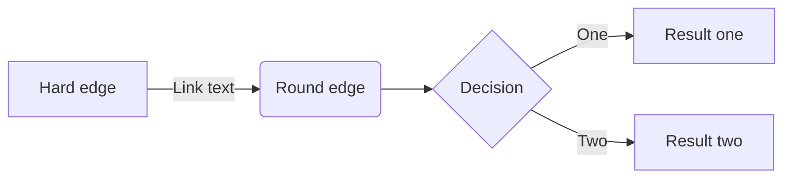
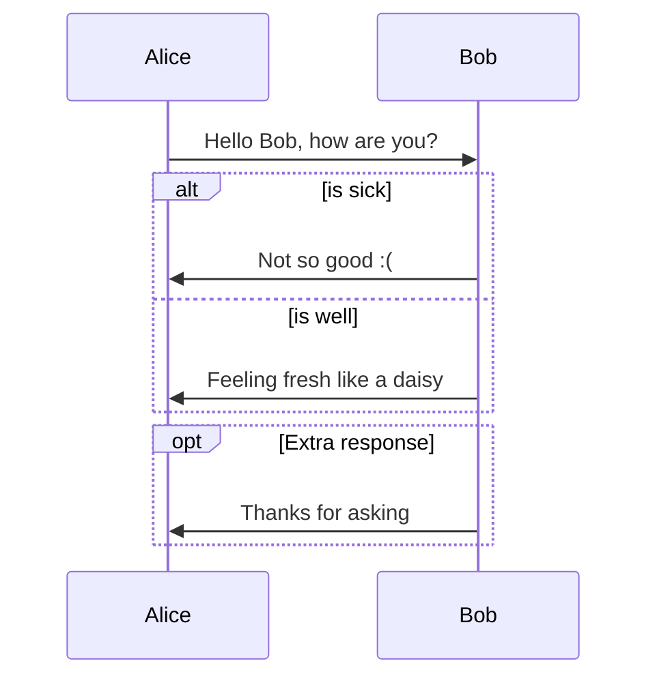
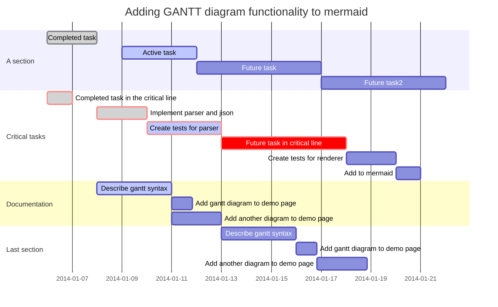

# Markdown 极简教程

## 目录

## 标题

Markdown 支持六个级别的标题。

```
语法：
# 一级标题
## 二级标题
### 三级标题
#### 四级标题
##### 五级标题
###### 六级标题
```

## 文本样式

> :bulb: 粗体、斜体、删除线可以混合使用。
>
> 在 Markdown 中，粗体文本、斜体文本可以使用 `*` 或 `_` 符号标记。建议统一风格，始终只用一种符号。

| 语法                                  | 效果                              |
| ------------------------------------- | --------------------------------- |
| 普通文本                              | 普通文本                          |
| `*斜体文本*` `_斜体文本_`             | _斜体文本_ _斜体文本_             |
| `**粗体文本**` `__粗体文本__`         | **粗体文本** **粗体文本**         |
| `~~删除文本~~`                        | ~~删除文本~~                      |
| `***粗斜体文本***` `___粗斜体文本___` | **_粗斜体文本_** **_粗斜体文本_** |

## 列表

### 无序列表

- RED
- YELLOW
- BLUE

### 有序列表

1. 第一步
2. 第二步
3. 第三步

### 任务列表

- [x] 完成任务
- [ ] 计划任务

### 多级列表

- 数据结构
  - 线性表
    - 顺序表
    - 链表
      - 单链表
      - 双链表
  - 树
    - 二叉树
      - 二叉平衡树

## 分割线

`***`、`---`、`___` 都可以作为分割线。

---

---

---

## 链接

### 普通链接

语法：

```
[钝悟的博客](https://dunwu.github.io/waterdrop/)
```

- `[]` 中标记链接名。类似 HTML 中 `<a>` 元素的 `title` 属性。
- `()` 中标记链接的 url，也支持相对路径（前提是资源可以访问）。类似 HTML 中 `<a>` 元素的 `href` 属性。

效果：

- [钝悟的博客](https://dunwu.github.io/waterdrop/ 'blog')

### 图片

Markdown 引用图片的语法：

```

```

alt 和 title 即对应 HTML 中 img 元素的 alt 和 title 属性（都可省略）：

- alt - 表示图片显示失败时的替换文本。
- title - 表示鼠标悬停在图片时的显示文本（注意这里要加引号）

- url - 即图片的 url 地址


### 图片链接

可以将图片和链接混合使用。

[](https://dunwu.github.io/waterdrop/)

### 锚点

其实呢，每一个标题都是一个锚点，和 HTML 的锚点（`#`）类似，比如：[回到顶部](#Markdown-应用指南)

## 引用

普通引用：

> :question: 什么是 `Markdown`
>
> **Markdown**是一种[轻量级标记语言](https://zh.wikipedia.org/wiki/轻量级标记语言)，创始人为[约翰·格鲁伯](https://zh.wikipedia.org/wiki/約翰·格魯伯)（英语：John Gruber）。它允许人们“使用易读易写的纯文本格式编写文档，然后转换成有效的[XHTML](https://zh.wikipedia.org/wiki/XHTML)（或者[HTML](https://zh.wikipedia.org/wiki/HTML)）文档”。[[4\]](https://zh.wikipedia.org/wiki/Markdown#cite_note-md-4)这种语言吸收了很多在[电子邮件](https://zh.wikipedia.org/wiki/电子邮件)中已有的纯文本标记的特性。 —— 摘自 Wiki

嵌套引用：

> 数据结构
>
> > 树
> >
> > > 二叉树
> > >
> > > > 平衡二叉树
> > > >
> > > > > 满二叉树

## 代码高亮

### 标签

语法：

```
`Markdown` `Doc`
```

效果：

`Markdown`, `Doc`

### 代码块

语法一：在文本前后都使用三个反引号进行标记。【✔️️️️ 推荐】

```
这是一个文本块。
这是一个文本块。
这是一个文本块。
```

语法二：在连续几行的文本开头加入 1 个 Tab 或者 4 个空格。【❌ 不推荐】

    这是一个文本块。
    这是一个文本块。
    这是一个文本块。

### 语法

在三个反引号后面加上编程语言的名字，另起一行开始写代码，最后一行再加上三个反引号。

```Java
public static void main(String[]args){} //Java
```

```c
int main(int argc, char *argv[]) //C
```

```Bash
echo "hello GitHub" #Bash
```

```javascript
document.getElementById('myH1').innerHTML = 'Welcome to my Homepage' //javascipt
```

```cpp
string &operator+(const string& A,const string& B) //cpp
```

## 表格

一般表格：

| 表头 1   | 表头 2   |
| -------- | -------- |
| 表格单元 | 表格单元 |
| 表格单元 | 表格单元 |

表格可以指定对齐方式：

| 序号 | 商品 |   价格 |
| :--: | :--- | -----: |
|  1   | 电脑 | 6000.0 |
|  2   | 鼠标 |  100.0 |
|  3   | 键盘 |  200.0 |

## Emoji 表情

> :bulb: 注意：部分 Markdown 引擎支持 Emoji。

合理使用 Emoji 表情，往往可以使得文章内容更加丰富生动。例如：:heavy_check_mark: :x: :bulb: :bell: :heavy_exclamation_mark: :question:

> 更多 Emoji 表情请参考：
>
> - [http://emojihomepage.com/](http://emojihomepage.com/)
> - [http://www.emoji-cheat-sheet.com](http://www.emoji-cheat-sheet.com)

## 注脚

> :bulb: 注意：部分 Markdown 引擎支持注脚。

一个具有注脚的文本。[^1]

[^1]: 注脚的解释

## 数学公式

> :bulb: 注意：部分 Markdown 引擎支持 Latex。

很多文档中，需要引入一些数学符号、特殊符号，其排版问题比较头疼。这种问题，可以用 Latex 来解决，大部分 Markdown 引擎都支持 Latex。

Latex 可以使用 `$` 符号来标记 Latex 表达式，下面是一个数学公式示例：

$$
\Gamma(z) = \int_0^\infty t^{z-1}e^{-t}dt\,.
$$

列举一些常用数学符号：

|      符号       | 语法              | 描述     |
| :-------------: | ----------------- | -------- |
|     $\leq$      | `$\leq$`          | 小于等于 |
|     $\geq$      | `$\geq$`          | 大于等于 |
|     $\neq$      | `$\neq$`          | 不等于   |
|    $\approx$    | `$\approx$`       | 约等于   |
|    $\infty$     | `$\infty$`        | 无穷     |
| $\prod_{x}^{y}$ | `$\prod_{x}^{y}$` | 累乘     |
| $\sum_{i=0}^n$  | `$\sum_{i=0}^n$`  | 求和     |
|     $\int$      | `$\int$`          | 积分     |
|     $\iint$     | `$\iint$`         | 双重积分 |
|   $\log_x{y}$   | `$\log_x{y}$`     | 对数     |
|    $x^{y+1}$    | `$x^{y+1}$`       | 上标     |
|    $x_{y+1}$    | `$x_{y+1}$`       | 下标     |
|  $\frac{x}{y}$  | `$\frac{x}{y}$`   | 分数     |
|  $\sqrt[y]{x}$  | `$\sqrt[y]{x}$`   | 开方     |
|     $\sin$      | `$\sin$`          | 正弦     |
|     $\cos$      | `$\cos$`          | 余弦     |
|     $\tan$      | `$\tan$`          | 正切     |

> 更多数学符号支持请参考：
>
> - [Begin-Latex-in-minutes](https://github.com/luong-komorebi/Begin-Latex-in-minutes)
> - [Markdown 数学符号&公式](https://blog.csdn.net/Katherine_hsr/article/details/79179622)

## Diff

> :bulb: 注意：部分 Markdown 引擎支持 Diff。

版本控制的系统中都少不了 diff 的功能，即展示一个文件内容的增加与删除。
GFM 中可以显示的展示 diff 效果。可以用 `+` 开头表示新增，`-` 开头表示删除。

```diff
+ 新增内容
- 删除内容
```

## UML 图

> 💡 注意：部分 Markdown 引擎支持 [mermaid](https://mermaid-js.github.io/mermaid/)。
>
> [mermaid](https://mermaid-js.github.io/mermaid/) 提供了多种 UML 图。详情请参考：[mermaid 文档](https://mermaidjs.github.io/)

### 流程图



### 时序图



### 甘特图



## HTML

有些 Markdown 引擎支持在文档中嵌入的 html 元素。

有些 Markdown 语法所不支持的特性，可以使用 html 元素来支持。

### 折叠

<details>
  <summary>折叠内容一</summary>
  <p>展开才能看到的内容</p>
</details>
<details>
  <summary>折叠内容二</summary>
  <p>展开才能看到的内容</p>
</details>

### 居中

<div align="center"><p>居中显示的文本</p></div>

### 图片尺寸

<div align="center"></div>

## 编辑器

推荐 Markdown 编辑器

- [Typora](https://www.typora.io/) - 个人认为是功能最强的 Markdown 编辑器。
- [Visual Studio Code](https://github.com/microsoft/vscode) - 可以通过安装插件，量身打造 Markdown 编辑器。
- [marktext](https://github.com/marktext/marktext) - 一款简单优雅的 Markdown 编辑器。
- [StackEdit](https://stackedit.io/) - 在线 Markdown 编辑器。
- [Editor.md](https://pandao.github.io/editor.md/) - 在线 Markdown 编辑器。
- [Marxico](https://maxiang.io/) - 一款专为印象笔记（Evernote）打造的 Markdown 编辑器。

> 想了解更多 Markdown 编辑器可以参考：[主流 Markdown 编辑器推荐](https://zhuanlan.zhihu.com/p/69210764)

## 参考资料

- https://zh.wikipedia.org/wiki/Markdown
- https://github.com/guodongxiaren/README
- [markdown-cheatsheet](https://github.com/tchapi/markdown-cheatsheet)
- [Begin-Latex-in-minutes](https://github.com/luong-komorebi/Begin-Latex-in-minutes)
- https://github.com/mermaid-js/mermaid