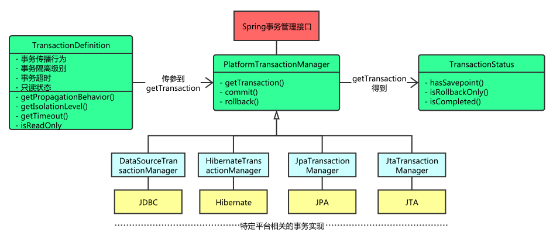

# 事务管理

## 理解事务

在软件开发领域，全有或全无的操作被称为**事务（transaction）**。事务允许你将几个操作组合成一个要么全部发生要么全部不发生的工作单元。

### 事务的特性

事务应该具有4个属性：原子性、一致性、隔离性、持久性。这四个属性通常称为 **ACID**。

- **原子性（Atomic）**：一个事务是一个不可分割的工作单位，事务中包括的诸操作要么都做，要么都不做。
- **一致性（Consistent）**：事务必须是使数据库从一个一致性状态变到另一个一致性状态。一致性与原子性是密切相关的。
- **隔离性（Isolated）**：一个事务的执行不能被其他事务干扰。即一个事务内部的操作及使用的数据对并发的其他事务是隔离的，并发执行的各个事务之间不能互相干扰。
- **持久性（Durable）**：持久性也称永久性（permanence），指一个事务一旦提交，它对数据库中数据的改变就应该是永久性的。接下来的其他操作或故障不应该对其有任何影响。

### Spring 对事务的支持

Spring 通过回调机制将实际的事务实现从事务性的代码中抽象出来。

Spring 提供了对编码式和声明式事务管理的支持。

- 编码式事务允许用户在代码中精确定义事务的边界
- 声明式事务（基于 AOP）有助于用户将操作与事务规则进行解耦

## 核心 API

### PlatformTransactionManager

Spring 并不直接管理事务，而是提供了多种事务管理器，它们将事务管理的职责委托给 JTA 或其他持久化机制所提供的平台相关的事务实现。

Spring 事务管理器的接口是 `org.springframework.transaction.PlatformTransactionManager`，通过这个接口，Spring为各个平台如 JDBC、Hibernate 等都提供了对应的事务管理器，但是具体的实现就是各个平台自己的事情了。

```java
public interface PlatformTransactionManager {

    TransactionStatus getTransaction(
            TransactionDefinition definition) throws TransactionException;

    void commit(TransactionStatus status) throws TransactionException;

    void rollback(TransactionStatus status) throws TransactionException;
}
```

从这里可知具体的具体的事务管理机制对 Spring 来说是透明的，它并不关心那些，那些是对应各个平台需要关心的，所以Spring 事务管理的一个优点就是为不同的事务 API 提供一致的编程模型，如 JTA、JDBC、Hibernate、JPA。下面分别介绍各个平台框架实现事务管理的机制。



#### JDBC事务

如果应用程序中直接使用JDBC来进行持久化，`DataSourceTransactionManager` 会为你处理事务边界。为了使用 `DataSourceTransactionManager`，你需要使用如下的XML将其装配到应用程序的上下文定义中：

```xml
<bean id="transactionManager" class="org.springframework.jdbc.datasource.DataSourceTransactionManager">
  <property name="dataSource" ref="dataSource" />
</bean>
```

实际上，`DataSourceTransactionManager` 是通过调用 `java.sql.Connection` 来管理事务，而后者是通过 `DataSource` 获取到的。通过调用连接的 `commit()` 方法来提交事务，同样，事务失败则通过调用 `rollback()` 方法进行回滚。

#### Hibernate事务

如果应用程序的持久化是通过 Hibernate 实现的，那么你需要使用 `HibernateTransactionManager`。对于Hibernate3，需要在 Spring 上下文定义中添加如下的 `bean` 声明：

```xml
<bean id="transactionManager" class="org.springframework.orm.hibernate3.HibernateTransactionManager">
  <property name="sessionFactory" ref="sessionFactory" />
</bean>
```

`sessionFactory` 属性需要装配一个 Hibernate 的 session 工厂，`HibernateTransactionManager` 的实现细节是它将事务管理的职责委托给 `org.hibernate.Transaction` 对象，而后者是从 Hibernate Session 中获取到的。当事务成功完成时，`HibernateTransactionManager` 将会调用 `Transaction` 对象的 `commit()` 方法，反之，将会调用 `rollback()` 方法。

#### Java持久化API事务（JPA）

Hibernate 多年来一直是事实上的 Java 持久化标准，但是现在 Java 持久化 API 作为真正的 Java 持久化标准进入大家的视野。如果你计划使用 JPA 的话，那你需要使用 Spring 的 `JpaTransactionManager` 来处理事务。你需要在 Spring 中这样配置 `JpaTransactionManager`：

```xml
<bean id="transactionManager" class="org.springframework.orm.jpa.JpaTransactionManager">
  <property name="sessionFactory" ref="sessionFactory" />
</bean>
```

`JpaTransactionManager` 只需要装配一个JPA实体管理工厂（`javax.persistence.EntityManagerFactory` 接口的任意实现）。`JpaTransactionManager` 将与由工厂所产生的 JPA EntityManager 合作来构建事务。

#### Java原生API事务（JTA）

如果你没有使用以上所述的事务管理，或者是跨越了多个事务管理源（比如两个或者是多个不同的数据源），你就需要使用`JtaTransactionManager`：

```xml
<bean id="transactionManager" class="org.springframework.transaction.jta.JtaTransactionManager">
  <property name="transactionManagerName" value="java:/TransactionManager" />
</bean>
```

`JtaTransactionManager` 将事务管理的责任委托给 `javax.transaction.UserTransaction` 和 `javax.transaction.TransactionManager` 对象，其中事务成功完成通过 `UserTransaction.commit()` 方法提交，事务失败通过 `UserTransaction.rollback()` 方法回滚。

### TransactionDefinition

上面讲到的事务管理器接口 `PlatformTransactionManager` 通过 `getTransaction(TransactionDefinition definition)` 方法来得到事务，这个方法里面的参数是 `TransactionDefinition` 类，这个类就定义了一些基本的事务属性。 
那么什么是事务属性呢？事务属性可以理解成事务的一些基本配置，描述了事务策略如何应用到方法上。事务属性包含了5个方面，如图所示：


而 `TransactionDefinition` 接口内容如下：

```java
public interface TransactionDefinition {
    int getPropagationBehavior(); // 返回事务的传播行为
    int getIsolationLevel(); // 返回事务的隔离级别，事务管理器根据它来控制另外一个事务可以看到本事务内的哪些数据
    int getTimeout();  // 返回事务必须在多少秒内完成
    boolean isReadOnly(); // 事务是否只读，事务管理器能够根据这个返回值进行优化，确保事务是只读的
} 
```

我们可以发现 `TransactionDefinition` 正好用来定义事务属性，下面详细介绍一下各个事务属性。

#### 传播行为

事务的第一个方面是传播行为（propagation behavior）。当事务方法被另一个事务方法调用时，必须指定事务应该如何传播。例如：方法可能继续在现有事务中运行，也可能开启一个新事务，并在自己的事务中运行。Spring定义了七种传播行为：

| 传播行为                      | 含义                                       |
| ------------------------- | ---------------------------------------- |
| PROPAGATION_REQUIRED      | 表示当前方法必须运行在事务中。如果当前事务存在，方法将会在该事务中运行。否则，会启动一个新的事务 |
| PROPAGATION_SUPPORTS      | 表示当前方法不需要事务上下文，但是如果存在当前事务的话，那么该方法会在这个事务中运行 |
| PROPAGATION_MANDATORY     | 表示该方法必须在事务中运行，如果当前事务不存在，则会抛出一个异常         |
| PROPAGATION_REQUIRED_NEW  | 表示当前方法必须运行在它自己的事务中。一个新的事务将被启动。如果存在当前事务，在该方法执行期间，当前事务会被挂起。如果使用JTATransactionManager的话，则需要访问TransactionManager |
| PROPAGATION_NOT_SUPPORTED | 表示该方法不应该运行在事务中。如果存在当前事务，在该方法运行期间，当前事务将被挂起。如果使用JTATransactionManager的话，则需要访问TransactionManager |
| PROPAGATION_NEVER         | 表示当前方法不应该运行在事务上下文中。如果当前正有一个事务在运行，则会抛出异常  |
| PROPAGATION_NESTED        | 表示如果当前已经存在一个事务，那么该方法将会在嵌套事务中运行。嵌套的事务可以独立于当前事务进行单独地提交或回滚。如果当前事务不存在，那么其行为与PROPAGATION_REQUIRED一样。注意各厂商对这种传播行为的支持是有所差异的。可以参考资源管理器的文档来确认它们是否支持嵌套事务 |

*注：以下具体讲解传播行为的内容参考自Spring事务机制详解* 

1. PROPAGATION_REQUIRED 如果存在一个事务，则支持当前事务。如果没有事务则开启一个新的事务。

```
//事务属性 PROPAGATION_REQUIRED
methodA{
    ……
    methodB();
    ……
}
```

```
//事务属性 PROPAGATION_REQUIRED
methodB{
   ……
}
```

使用spring声明式事务，spring使用AOP来支持声明式事务，会根据事务属性，自动在方法调用之前决定是否开启一个事务，并在方法执行之后决定事务提交或回滚事务。

单独调用methodB方法：

```
main{ 
    metodB(); 
}  
```

相当于

```
Main{ 
    Connection con=null; 
    try{ 
        con = getConnection(); 
        con.setAutoCommit(false); 

        //方法调用
        methodB(); 

        //提交事务
        con.commit(); 
    } Catch(RuntimeException ex) { 
        //回滚事务
        con.rollback();   
    } finally { 
        //释放资源
        closeCon(); 
    } 
} 
```

Spring保证在methodB方法中所有的调用都获得到一个相同的连接。在调用methodB时，没有一个存在的事务，所以获得一个新的连接，开启了一个新的事务。 
单独调用MethodA时，在MethodA内又会调用MethodB.

执行效果相当于：

```
main{ 
    Connection con = null; 
    try{ 
        con = getConnection(); 
        methodA(); 
        con.commit(); 
    } catch(RuntimeException ex) { 
        con.rollback(); 
    } finally {    
        closeCon(); 
    }  
} 
```

调用MethodA时，环境中没有事务，所以开启一个新的事务.当在MethodA中调用MethodB时，环境中已经有了一个事务，所以methodB就加入当前事务。

2. `PROPAGATION_SUPPORTS` 如果存在一个事务，支持当前事务。如果没有事务，则非事务的执行。但是对于事务同步的事务管理器，`PROPAGATION_SUPPORTS` 与不使用事务有少许不同。

```
//事务属性 PROPAGATION_REQUIRED
methodA(){
  methodB();
}

//事务属性 PROPAGATION_SUPPORTS
methodB(){
  ……
}
```

单纯的调用methodB时，methodB方法是非事务的执行的。当调用methdA时,methodB则加入了methodA的事务中,事务地执行。

3. `PROPAGATION_MANDATORY` 如果已经存在一个事务，支持当前事务。如果没有一个活动的事务，则抛出异常。

```
//事务属性 PROPAGATION_REQUIRED
methodA(){
    methodB();
}

//事务属性 PROPAGATION_MANDATORY
    methodB(){
    ……
}
```

当单独调用methodB时，因为当前没有一个活动的事务，则会抛出异常throw new IllegalTransactionStateException(“Transaction propagation ‘mandatory’ but no existing transaction found”);当调用methodA时，methodB则加入到methodA的事务中，事务地执行。

4. `PROPAGATION_REQUIRES_NEW` 总是开启一个新的事务。如果一个事务已经存在，则将这个存在的事务挂起。

```
//事务属性 PROPAGATION_REQUIRED
methodA(){
    doSomeThingA();
    methodB();
    doSomeThingB();
}

//事务属性 PROPAGATION_REQUIRES_NEW
methodB(){
    ……
}
```

调用A方法：

```
main(){
    methodA();
}
```

相当于

```
main(){
    TransactionManager tm = null;
    try{
        //获得一个JTA事务管理器
        tm = getTransactionManager();
        tm.begin();//开启一个新的事务
        Transaction ts1 = tm.getTransaction();
        doSomeThing();
        tm.suspend();//挂起当前事务
        try{
            tm.begin();//重新开启第二个事务
            Transaction ts2 = tm.getTransaction();
            methodB();
            ts2.commit();//提交第二个事务
        } Catch(RunTimeException ex) {
            ts2.rollback();//回滚第二个事务
        } finally {
            //释放资源
        }
        //methodB执行完后，恢复第一个事务
        tm.resume(ts1);
        doSomeThingB();
        ts1.commit();//提交第一个事务
    } catch(RunTimeException ex) {
        ts1.rollback();//回滚第一个事务
    } finally {
        //释放资源
    }
}
```

在这里，我把ts1称为外层事务，ts2称为内层事务。从上面的代码可以看出，ts2与ts1是两个独立的事务，互不相干。Ts2是否成功并不依赖于 ts1。如果methodA方法在调用methodB方法后的doSomeThingB方法失败了，而methodB方法所做的结果依然被提交。而除了 methodB之外的其它代码导致的结果却被回滚了。使用PROPAGATION_REQUIRES_NEW,需要使用 JtaTransactionManager作为事务管理器。

5. `PROPAGATION_NOT_SUPPORTED` 总是非事务地执行，并挂起任何存在的事务。使用PROPAGATION_NOT_SUPPORTED,也需要使用JtaTransactionManager作为事务管理器。（代码示例同上，可同理推出）
6. PROPAGATION_NEVER 总是非事务地执行，如果存在一个活动事务，则抛出异常。
7. PROPAGATION_NESTED如果一个活动的事务存在，则运行在一个嵌套的事务中. 如果没有活动事务, 则按TransactionDefinition.PROPAGATION_REQUIRED 属性执行。这是一个嵌套事务,使用JDBC 3.0驱动时,仅仅支持DataSourceTransactionManager作为事务管理器。需要JDBC 驱动的java.sql.Savepoint类。有一些JTA的事务管理器实现可能也提供了同样的功能。使用PROPAGATION_NESTED，还需要把PlatformTransactionManager的nestedTransactionAllowed属性设为true;而 nestedTransactionAllowed属性值默认为false。

```
//事务属性 PROPAGATION_REQUIRED
methodA(){
    doSomeThingA();
    methodB();
    doSomeThingB();
}

//事务属性 PROPAGATION_NESTED
methodB(){
    ……
}
```

如果单独调用methodB方法，则按REQUIRED属性执行。如果调用methodA方法，相当于下面的效果：

```
main(){
    Connection con = null;
    Savepoint savepoint = null;
    try{
        con = getConnection();
        con.setAutoCommit(false);
        doSomeThingA();
        savepoint = con2.setSavepoint();
        try{
            methodB();
        } catch(RuntimeException ex) {
            con.rollback(savepoint);
        } finally {
            //释放资源
        }
        doSomeThingB();
        con.commit();
    } catch(RuntimeException ex) {
        con.rollback();
    } finally {
        //释放资源
    }
}
```

当methodB方法调用之前，调用setSavepoint方法，保存当前的状态到savepoint。如果methodB方法调用失败，则恢复到之前保存的状态。但是需要注意的是，这时的事务并没有进行提交，如果后续的代码(doSomeThingB()方法)调用失败，则回滚包括methodB方法的所有操作。

嵌套事务一个非常重要的概念就是内层事务依赖于外层事务。外层事务失败时，会回滚内层事务所做的动作。而内层事务操作失败并不会引起外层事务的回滚。

PROPAGATION_NESTED 与PROPAGATION_REQUIRES_NEW的区别:它们非常类似,都像一个嵌套事务，如果不存在一个活动的事务，都会开启一个新的事务。使用 PROPAGATION_REQUIRES_NEW时，内层事务与外层事务就像两个独立的事务一样，一旦内层事务进行了提交后，外层事务不能对其进行回滚。两个事务互不影响。两个事务不是一个真正的嵌套事务。同时它需要JTA事务管理器的支持。

使用PROPAGATION_NESTED时，外层事务的回滚可以引起内层事务的回滚。而内层事务的异常并不会导致外层事务的回滚，它是一个真正的嵌套事务。DataSourceTransactionManager使用savepoint支持PROPAGATION_NESTED时，需要JDBC 3.0以上驱动及1.4以上的JDK版本支持。其它的JTA TrasactionManager实现可能有不同的支持方式。

PROPAGATION_REQUIRES_NEW 启动一个新的, 不依赖于环境的 “内部” 事务. 这个事务将被完全 commited 或 rolled back 而不依赖于外部事务, 它拥有自己的隔离范围, 自己的锁, 等等. 当内部事务开始执行时, 外部事务将被挂起, 内务事务结束时, 外部事务将继续执行。

另一方面, PROPAGATION_NESTED 开始一个 “嵌套的” 事务, 它是已经存在事务的一个真正的子事务. 潜套事务开始执行时, 它将取得一个 savepoint. 如果这个嵌套事务失败, 我们将回滚到此 savepoint. 潜套事务是外部事务的一部分, 只有外部事务结束后它才会被提交。

由此可见, PROPAGATION_REQUIRES_NEW 和 PROPAGATION_NESTED 的最大区别在于, PROPAGATION_REQUIRES_NEW 完全是一个新的事务, 而 PROPAGATION_NESTED 则是外部事务的子事务, 如果外部事务 commit, 嵌套事务也会被 commit, 这个规则同样适用于 roll back.

PROPAGATION_REQUIRED应该是我们首先的事务传播行为。它能够满足我们大多数的事务需求。

#### 隔离级别

事务的第二个维度就是隔离级别（isolation level）。隔离级别定义了一个事务可能受其他并发事务影响的程度。

1. 并发事务引起的问题 

在典型的应用程序中，多个事务并发运行，经常会操作相同的数据来完成各自的任务。并发虽然是必须的，但可能会导致一下的问题。

> - 脏读（Dirty reads）——脏读发生在一个事务读取了另一个事务改写但尚未提交的数据时。如果改写在稍后被回滚了，那么第一个事务获取的数据就是无效的。
> - 不可重复读（Nonrepeatable read）——不可重复读发生在一个事务执行相同的查询两次或两次以上，但是每次都得到不同的数据时。这通常是因为另一个并发事务在两次查询期间进行了更新。
> - 幻读（Phantom read）——幻读与不可重复读类似。它发生在一个事务（T1）读取了几行数据，接着另一个并发事务（T2）插入了一些数据时。在随后的查询中，第一个事务（T1）就会发现多了一些原本不存在的记录。

**不可重复读与幻读的区别**

不可重复读的重点是修改: 
同样的条件, 你读取过的数据, 再次读取出来发现值不一样了 
例如：在事务1中，Mary 读取了自己的工资为1000,操作并没有完成

```
    con1 = getConnection();  
    select salary from employee empId ="Mary";  
```

在事务2中，这时财务人员修改了Mary的工资为2000,并提交了事务.

```
    con2 = getConnection();  
    update employee set salary = 2000;  
    con2.commit();  
```

在事务1中，Mary 再次读取自己的工资时，工资变为了2000

```
    //con1  
    select salary from employee empId ="Mary"; 
```

在一个事务中前后两次读取的结果并不一致，导致了不可重复读。

幻读的重点在于新增或者删除： 
同样的条件, 第1次和第2次读出来的记录数不一样 
例如：目前工资为1000的员工有10人。事务1,读取所有工资为1000的员工。

```
    con1 = getConnection();  
    Select * from employee where salary =1000; 
```

共读取10条记录

这时另一个事务向employee表插入了一条员工记录，工资也为1000

```
    con2 = getConnection();  
    Insert into employee(empId,salary) values("Lili",1000);  
    con2.commit();  
```

事务1再次读取所有工资为1000的员工

```
    //con1  
    select * from employee where salary =1000;  
```

共读取到了11条记录，这就产生了幻像读。

从总的结果来看, 似乎不可重复读和幻读都表现为两次读取的结果不一致。但如果你从控制的角度来看, 两者的区别就比较大。 
对于前者, 只需要锁住满足条件的记录。 
对于后者, 要锁住满足条件及其相近的记录。

2. 隔离级别

| 隔离级别                       | 含义                                       |
| -------------------------- | ---------------------------------------- |
| ISOLATION_DEFAULT          | 使用后端数据库默认的隔离级别                           |
| ISOLATION_READ_UNCOMMITTED | 最低的隔离级别，允许读取尚未提交的数据变更，可能会导致脏读、幻读或不可重复读   |
| ISOLATION_READ_COMMITTED   | 允许读取并发事务已经提交的数据，可以阻止脏读，但是幻读或不可重复读仍有可能发生  |
| ISOLATION_REPEATABLE_READ  | 对同一字段的多次读取结果都是一致的，除非数据是被本身事务自己所修改，可以阻止脏读和不可重复读，但幻读仍有可能发生 |
| ISOLATION_SERIALIZABLE     | 最高的隔离级别，完全服从ACID的隔离级别，确保阻止脏读、不可重复读以及幻读，也是最慢的事务隔离级别，因为它通常是通过完全锁定事务相关的数据库表来实现的 |

#### 只读

事务的第三个特性是它是否为只读事务。如果事务只对后端的数据库进行该操作，数据库可以利用事务的只读特性来进行一些特定的优化。通过将事务设置为只读，你就可以给数据库一个机会，让它应用它认为合适的优化措施。

#### 事务超时

为了使应用程序很好地运行，事务不能运行太长的时间。因为事务可能涉及对后端数据库的锁定，所以长时间的事务会不必要的占用数据库资源。事务超时就是事务的一个定时器，在特定时间内事务如果没有执行完毕，那么就会自动回滚，而不是一直等待其结束。

#### 回滚规则

事务五边形的最后一个方面是一组规则，这些规则定义了哪些异常会导致事务回滚而哪些不会。默认情况下，事务只有遇到运行期异常时才会回滚，而在遇到检查型异常时不会回滚（这一行为与EJB的回滚行为是一致的） 
但是你可以声明事务在遇到特定的检查型异常时像遇到运行期异常那样回滚。同样，你还可以声明事务遇到特定的异常不回滚，即使这些异常是运行期异常。

### TransactionStatus

上面讲到的调用 `PlatformTransactionManager` 接口的 `getTransaction()` 的方法得到的是 `TransactionStatus` 接口的一个实现，这个接口的内容如下：

```java
public interface TransactionStatus extends SavepointManager {
    boolean isNewTransaction(); // 是否是新的事物
    boolean hasSavepoint(); // 是否有恢复点
    void setRollbackOnly();  // 设置为只回滚
    boolean isRollbackOnly(); // 是否为只回滚
    boolean isCompleted; // 是否已完成
}
```

可以发现这个接口描述的是一些处理事务提供简单的控制事务执行和查询事务状态的方法，在回滚或提交的时候需要应用对应的事务状态。

## 编程式事务

### 编程式和声明式事务的区别

Spring 提供了对编程式事务和声明式事务的支持。编程式事务允许用户在代码中精确定义事务的边界，而声明式事务（基于AOP）有助于用户将操作与事务规则进行解耦。 
简单地说，编程式事务侵入到了业务代码里面，但是提供了更加详细的事务管理；而声明式事务由于基于 AOP，所以既能起到事务管理的作用，又可以不影响业务代码的具体实现。

Spring 提供两种方式的编程式事务管理，分别是：使用 `TransactionTemplate` 和使用 `PlatformTransactionManager`。

### 使用TransactionTemplate

采用TransactionTemplate和采用其他Spring模板，如JdbcTempalte和HibernateTemplate是一样的方法。它使用回调方法，把应用程序从处理取得和释放资源中解脱出来。如同其他模板，TransactionTemplate是线程安全的。代码片段：

```java
    TransactionTemplate tt = new TransactionTemplate(); // 新建一个TransactionTemplate
    Object result = tt.execute(
        new TransactionCallback(){  
            public Object doTransaction(TransactionStatus status){  
                updateOperation();  
                return resultOfUpdateOperation();  
            }  
    }); // 执行execute方法进行事务管理
```

使用TransactionCallback()可以返回一个值。如果使用TransactionCallbackWithoutResult则没有返回值。

### 使用PlatformTransactionManager

示例代码如下：

```java
    DataSourceTransactionManager dataSourceTransactionManager = new DataSourceTransactionManager(); //定义一个某个框架平台的TransactionManager，如JDBC、Hibernate
    dataSourceTransactionManager.setDataSource(this.getJdbcTemplate().getDataSource()); // 设置数据源
    DefaultTransactionDefinition transDef = new DefaultTransactionDefinition(); // 定义事务属性
    transDef.setPropagationBehavior(DefaultTransactionDefinition.PROPAGATION_REQUIRED); // 设置传播行为属性
    TransactionStatus status = dataSourceTransactionManager.getTransaction(transDef); // 获得事务状态
    try {
        // 数据库操作
        dataSourceTransactionManager.commit(status);// 提交
    } catch (Exception e) {
        dataSourceTransactionManager.rollback(status);// 回滚
    }
```

## 声明式事务

### 配置方式

*注：以下配置代码参考自Spring事务配置的五种方式*

根据代理机制的不同，总结了五种Spring事务的配置方式，配置文件如下：

1. 每个Bean都有一个代理

```xml
<?xml version="1.0" encoding="UTF-8"?>
<beans xmlns="http://www.springframework.org/schema/beans"
    xmlns:xsi="http://www.w3.org/2001/XMLSchema-instance"
    xmlns:context="http://www.springframework.org/schema/context"
    xmlns:aop="http://www.springframework.org/schema/aop"
    xsi:schemaLocation="http://www.springframework.org/schema/beans
           http://www.springframework.org/schema/beans/spring-beans-2.5.xsd
           http://www.springframework.org/schema/context
           http://www.springframework.org/schema/context/spring-context-2.5.xsd
           http://www.springframework.org/schema/aop http://www.springframework.org/schema/aop/spring-aop-2.5.xsd">

    <bean id="sessionFactory" 
            class="org.springframework.orm.hibernate3.LocalSessionFactoryBean"> 
        <property name="configLocation" value="classpath:hibernate.cfg.xml" /> 
        <property name="configurationClass" value="org.hibernate.cfg.AnnotationConfiguration" />
    </bean> 

    <!-- 定义事务管理器（声明式的事务） --> 
    <bean id="transactionManager"
        class="org.springframework.orm.hibernate3.HibernateTransactionManager">
        <property name="sessionFactory" ref="sessionFactory" />
    </bean>

    <!-- 配置DAO -->
    <bean id="userDaoTarget" class="com.bluesky.spring.dao.UserDaoImpl">
        <property name="sessionFactory" ref="sessionFactory" />
    </bean>

    <bean id="userDao" 
        class="org.springframework.transaction.interceptor.TransactionProxyFactoryBean"> 
           <!-- 配置事务管理器 --> 
           <property name="transactionManager" ref="transactionManager" />    
        <property name="target" ref="userDaoTarget" /> 
         <property name="proxyInterfaces" value="com.bluesky.spring.dao.GeneratorDao" />
        <!-- 配置事务属性 --> 
        <property name="transactionAttributes"> 
            <props> 
                <prop key="*">PROPAGATION_REQUIRED</prop>
            </props> 
        </property> 
    </bean> 
</beans>
```

2. 所有Bean共享一个代理基类

```xml
<?xml version="1.0" encoding="UTF-8"?>
<beans xmlns="http://www.springframework.org/schema/beans"
    xmlns:xsi="http://www.w3.org/2001/XMLSchema-instance"
    xmlns:context="http://www.springframework.org/schema/context"
    xmlns:aop="http://www.springframework.org/schema/aop"
    xsi:schemaLocation="http://www.springframework.org/schema/beans
           http://www.springframework.org/schema/beans/spring-beans-2.5.xsd
           http://www.springframework.org/schema/context
           http://www.springframework.org/schema/context/spring-context-2.5.xsd
           http://www.springframework.org/schema/aop http://www.springframework.org/schema/aop/spring-aop-2.5.xsd">

    <bean id="sessionFactory" 
            class="org.springframework.orm.hibernate3.LocalSessionFactoryBean"> 
        <property name="configLocation" value="classpath:hibernate.cfg.xml" /> 
        <property name="configurationClass" value="org.hibernate.cfg.AnnotationConfiguration" />
    </bean> 

    <!-- 定义事务管理器（声明式的事务） --> 
    <bean id="transactionManager"
        class="org.springframework.orm.hibernate3.HibernateTransactionManager">
        <property name="sessionFactory" ref="sessionFactory" />
    </bean>

    <bean id="transactionBase" 
            class="org.springframework.transaction.interceptor.TransactionProxyFactoryBean" 
            lazy-init="true" abstract="true"> 
        <!-- 配置事务管理器 --> 
        <property name="transactionManager" ref="transactionManager" /> 
        <!-- 配置事务属性 --> 
        <property name="transactionAttributes"> 
            <props> 
                <prop key="*">PROPAGATION_REQUIRED</prop> 
            </props> 
        </property> 
    </bean>   

    <!-- 配置DAO -->
    <bean id="userDaoTarget" class="com.bluesky.spring.dao.UserDaoImpl">
        <property name="sessionFactory" ref="sessionFactory" />
    </bean>

    <bean id="userDao" parent="transactionBase" > 
        <property name="target" ref="userDaoTarget" />  
    </bean>
</beans>
```

3. 使用拦截器

```xml
<?xml version="1.0" encoding="UTF-8"?>
<beans xmlns="http://www.springframework.org/schema/beans"
    xmlns:xsi="http://www.w3.org/2001/XMLSchema-instance"
    xmlns:context="http://www.springframework.org/schema/context"
    xmlns:aop="http://www.springframework.org/schema/aop"
    xsi:schemaLocation="http://www.springframework.org/schema/beans
           http://www.springframework.org/schema/beans/spring-beans-2.5.xsd
           http://www.springframework.org/schema/context
           http://www.springframework.org/schema/context/spring-context-2.5.xsd
           http://www.springframework.org/schema/aop http://www.springframework.org/schema/aop/spring-aop-2.5.xsd">

    <bean id="sessionFactory" 
            class="org.springframework.orm.hibernate3.LocalSessionFactoryBean"> 
        <property name="configLocation" value="classpath:hibernate.cfg.xml" /> 
        <property name="configurationClass" value="org.hibernate.cfg.AnnotationConfiguration" />
    </bean> 

    <!-- 定义事务管理器（声明式的事务） --> 
    <bean id="transactionManager"
        class="org.springframework.orm.hibernate3.HibernateTransactionManager">
        <property name="sessionFactory" ref="sessionFactory" />
    </bean> 

    <bean id="transactionInterceptor" 
        class="org.springframework.transaction.interceptor.TransactionInterceptor"> 
        <property name="transactionManager" ref="transactionManager" /> 
        <!-- 配置事务属性 --> 
        <property name="transactionAttributes"> 
            <props> 
                <prop key="*">PROPAGATION_REQUIRED</prop> 
            </props> 
        </property> 
    </bean>

    <bean class="org.springframework.aop.framework.autoproxy.BeanNameAutoProxyCreator"> 
        <property name="beanNames"> 
            <list> 
                <value>*Dao</value>
            </list> 
        </property> 
        <property name="interceptorNames"> 
            <list> 
                <value>transactionInterceptor</value> 
            </list> 
        </property> 
    </bean> 

    <!-- 配置DAO -->
    <bean id="userDao" class="com.bluesky.spring.dao.UserDaoImpl">
        <property name="sessionFactory" ref="sessionFactory" />
    </bean>
</beans>
```

4. 使用tx标签配置的拦截器

```xml
<?xml version="1.0" encoding="UTF-8"?>
<beans xmlns="http://www.springframework.org/schema/beans"
    xmlns:xsi="http://www.w3.org/2001/XMLSchema-instance"
    xmlns:context="http://www.springframework.org/schema/context"
    xmlns:aop="http://www.springframework.org/schema/aop"
    xmlns:tx="http://www.springframework.org/schema/tx"
    xsi:schemaLocation="http://www.springframework.org/schema/beans
           http://www.springframework.org/schema/beans/spring-beans-2.5.xsd
           http://www.springframework.org/schema/context
           http://www.springframework.org/schema/context/spring-context-2.5.xsd
           http://www.springframework.org/schema/aop http://www.springframework.org/schema/aop/spring-aop-2.5.xsd
           http://www.springframework.org/schema/tx http://www.springframework.org/schema/tx/spring-tx-2.5.xsd">

    <context:annotation-config />
    <context:component-scan base-package="com.bluesky" />

    <bean id="sessionFactory" 
            class="org.springframework.orm.hibernate3.LocalSessionFactoryBean"> 
        <property name="configLocation" value="classpath:hibernate.cfg.xml" /> 
        <property name="configurationClass" value="org.hibernate.cfg.AnnotationConfiguration" />
    </bean> 

    <!-- 定义事务管理器（声明式的事务） --> 
    <bean id="transactionManager"
        class="org.springframework.orm.hibernate3.HibernateTransactionManager">
        <property name="sessionFactory" ref="sessionFactory" />
    </bean>

    <tx:advice id="txAdvice" transaction-manager="transactionManager">
        <tx:attributes>
            <tx:method name="*" propagation="REQUIRED" />
        </tx:attributes>
    </tx:advice>

    <aop:config>
        <aop:pointcut id="interceptorPointCuts"
            expression="execution(* com.bluesky.spring.dao.*.*(..))" />
        <aop:advisor advice-ref="txAdvice"
            pointcut-ref="interceptorPointCuts" />       
    </aop:config>     
</beans>
```

5. 全注解

```xml
<?xml version="1.0" encoding="UTF-8"?>
<beans xmlns="http://www.springframework.org/schema/beans"
    xmlns:xsi="http://www.w3.org/2001/XMLSchema-instance"
    xmlns:context="http://www.springframework.org/schema/context"
    xmlns:aop="http://www.springframework.org/schema/aop"
    xmlns:tx="http://www.springframework.org/schema/tx"
    xsi:schemaLocation="http://www.springframework.org/schema/beans
           http://www.springframework.org/schema/beans/spring-beans-2.5.xsd
           http://www.springframework.org/schema/context
           http://www.springframework.org/schema/context/spring-context-2.5.xsd
           http://www.springframework.org/schema/aop http://www.springframework.org/schema/aop/spring-aop-2.5.xsd
           http://www.springframework.org/schema/tx http://www.springframework.org/schema/tx/spring-tx-2.5.xsd">

    <context:annotation-config />
    <context:component-scan base-package="com.bluesky" />

    <tx:annotation-driven transaction-manager="transactionManager"/>

    <bean id="sessionFactory" 
            class="org.springframework.orm.hibernate3.LocalSessionFactoryBean"> 
        <property name="configLocation" value="classpath:hibernate.cfg.xml" /> 
        <property name="configurationClass" value="org.hibernate.cfg.AnnotationConfiguration" />
    </bean> 

    <!-- 定义事务管理器（声明式的事务） --> 
    <bean id="transactionManager"
        class="org.springframework.orm.hibernate3.HibernateTransactionManager">
        <property name="sessionFactory" ref="sessionFactory" />
    </bean>

</beans>
```

此时在DAO上需加上@Transactional注解，如下：

```java
package com.bluesky.spring.dao;

import java.util.List;

import org.hibernate.SessionFactory;
import org.springframework.beans.factory.annotation.Autowired;
import org.springframework.orm.hibernate3.support.HibernateDaoSupport;
import org.springframework.stereotype.Component;

import com.bluesky.spring.domain.User;

@Transactional
@Component("userDao")
public class UserDaoImpl extends HibernateDaoSupport implements UserDao {

    public List<User> listUsers() {
        return this.getSession().createQuery("from User").list();
    }  
}
```

### 一个声明式事务的实例

*注：该实例参考自Spring中的事务管理实例详解*

**首先是数据库表** 

book(isbn, book_name, price) 

account(username, balance) 

book_stock(isbn, stock)

**然后是XML配置**

```xml
<beans xmlns="http://www.springframework.org/schema/beans"
xmlns:xsi="http://www.w3.org/2001/XMLSchema-instance"
xmlns:context="http://www.springframework.org/schema/context"
xmlns:aop="http://www.springframework.org/schema/aop"
xmlns:tx="http://www.springframework.org/schema/tx"
xsi:schemaLocation="http://www.springframework.org/schema/beans
http://www.springframework.org/schema/beans/spring-beans-3.0.xsd
http://www.springframework.org/schema/context
http://www.springframework.org/schema/context/spring-context-3.0.xsd
http://www.springframework.org/schema/aop http://www.springframework.org/schema/aop/spring-aop-2.5.xsd
http://www.springframework.org/schema/tx http://www.springframework.org/schema/tx/spring-tx-2.5.xsd">

    <import resource="applicationContext-db.xml" />

    <context:component-scan
        base-package="com.springinaction.transaction">
    </context:component-scan>

    <tx:annotation-driven transaction-manager="txManager"/>

    <bean id="transactionManager" class="org.springframework.jdbc.datasource.DataSourceTransactionManager">
        <property name="dataSource" ref="dataSource" />
    </bean>

</beans>
```

**使用的类** 
BookShopDao

```java
package com.springinaction.transaction;

public interface BookShopDao {
    // 根据书号获取书的单价
    public int findBookPriceByIsbn(String isbn);
    // 更新书的库存，使书号对应的库存-1
    public void updateBookStock(String isbn);
    // 更新用户的账户余额：account的balance-price
    public void updateUserAccount(String username, int price);
}
```

BookShopDaoImpl

```java
package com.springinaction.transaction;

import org.springframework.beans.factory.annotation.Autowired;
import org.springframework.jdbc.core.JdbcTemplate;
import org.springframework.stereotype.Repository;

@Repository("bookShopDao")
public class BookShopDaoImpl implements BookShopDao {

    @Autowired
    private JdbcTemplate JdbcTemplate;

    @Override
    public int findBookPriceByIsbn(String isbn) {
        String sql = "SELECT price FROM book WHERE isbn = ?";

        return JdbcTemplate.queryForObject(sql, Integer.class, isbn);
    }

    @Override
    public void updateBookStock(String isbn) {
        //检查书的库存是否足够，若不够，则抛出异常
        String sql2 = "SELECT stock FROM book_stock WHERE isbn = ?";
        int stock = JdbcTemplate.queryForObject(sql2, Integer.class, isbn);
        if (stock == 0) {
            throw new BookStockException("库存不足！");
        }
        String sql = "UPDATE book_stock SET stock = stock - 1 WHERE isbn = ?";
        JdbcTemplate.update(sql, isbn);
    }

    @Override
    public void updateUserAccount(String username, int price) {
        //检查余额是否不足，若不足，则抛出异常
        String sql2 = "SELECT balance FROM account WHERE username = ?";
        int balance = JdbcTemplate.queryForObject(sql2, Integer.class, username);
        if (balance < price) {
            throw new UserAccountException("余额不足！");
        }       
        String sql = "UPDATE account SET balance = balance - ? WHERE username = ?";
        JdbcTemplate.update(sql, price, username);
    }

}
```

BookShopService

```java
package com.springinaction.transaction;
public interface BookShopService {
     public void purchase(String username, String isbn);
}
```

BookShopServiceImpl

```java
package com.springinaction.transaction;

import org.springframework.beans.factory.annotation.Autowired;
import org.springframework.stereotype.Service;
import org.springframework.transaction.annotation.Isolation;
import org.springframework.transaction.annotation.Propagation;
import org.springframework.transaction.annotation.Transactional;

@Service("bookShopService")
public class BookShopServiceImpl implements BookShopService {

    @Autowired
    private BookShopDao bookShopDao;

    /**
     * 1.添加事务注解
     * 使用propagation 指定事务的传播行为，即当前的事务方法被另外一个事务方法调用时如何使用事务。
     * 默认取值为REQUIRED，即使用调用方法的事务
     * REQUIRES_NEW：使用自己的事务，调用的事务方法的事务被挂起。
     *
     * 2.使用isolation 指定事务的隔离级别，最常用的取值为READ_COMMITTED
     * 3.默认情况下 Spring 的声明式事务对所有的运行时异常进行回滚，也可以通过对应的属性进行设置。通常情况下，默认值即可。
     * 4.使用readOnly 指定事务是否为只读。 表示这个事务只读取数据但不更新数据，这样可以帮助数据库引擎优化事务。若真的是一个只读取数据库值得方法，应设置readOnly=true
     * 5.使用timeOut 指定强制回滚之前事务可以占用的时间。
     */
    @Transactional(propagation=Propagation.REQUIRES_NEW,
            isolation=Isolation.READ_COMMITTED,
            noRollbackFor={UserAccountException.class},
            readOnly=true, timeout=3)
    @Override
    public void purchase(String username, String isbn) {
        //1.获取书的单价
        int price = bookShopDao.findBookPriceByIsbn(isbn);
        //2.更新书的库存
        bookShopDao.updateBookStock(isbn);
        //3.更新用户余额
        bookShopDao.updateUserAccount(username, price);
    }
}
```

Cashier

```java
package com.springinaction.transaction;
import java.util.List;
public interface Cashier {
    public void checkout(String username, List<String>isbns);
}
```

CashierImpl：CashierImpl.checkout和bookShopService.purchase联合测试了事务的传播行为

```java
package com.springinaction.transaction;

import java.util.List;

import org.springframework.beans.factory.annotation.Autowired;
import org.springframework.stereotype.Service;
import org.springframework.transaction.annotation.Transactional;

@Service("cashier")
public class CashierImpl implements Cashier {
    @Autowired
    private BookShopService bookShopService;

    @Transactional
    @Override
    public void checkout(String username, List<String> isbns) {
        for(String isbn : isbns) {
            bookShopService.purchase(username, isbn);
        }
    }
}
```

BookStockException

```java
package com.springinaction.transaction;
public class BookStockException extends RuntimeException {

    private static final long serialVersionUID = 1L;

    public BookStockException() {
        super();
        // TODO Auto-generated constructor stub
    }

    public BookStockException(String arg0, Throwable arg1, boolean arg2,
            boolean arg3) {
        super(arg0, arg1, arg2, arg3);
        // TODO Auto-generated constructor stub
    }

    public BookStockException(String arg0, Throwable arg1) {
        super(arg0, arg1);
        // TODO Auto-generated constructor stub
    }

    public BookStockException(String arg0) {
        super(arg0);
        // TODO Auto-generated constructor stub
    }

    public BookStockException(Throwable arg0) {
        super(arg0);
        // TODO Auto-generated constructor stub
    }
}
```

UserAccountException

```java
package com.springinaction.transaction;
public class UserAccountException extends RuntimeException {

    private static final long serialVersionUID = 1L;

    public UserAccountException() {
        super();
        // TODO Auto-generated constructor stub
    }

    public UserAccountException(String arg0, Throwable arg1, boolean arg2,
            boolean arg3) {
        super(arg0, arg1, arg2, arg3);
        // TODO Auto-generated constructor stub
    }

    public UserAccountException(String arg0, Throwable arg1) {
        super(arg0, arg1);
        // TODO Auto-generated constructor stub
    }

    public UserAccountException(String arg0) {
        super(arg0);
        // TODO Auto-generated constructor stub
    }

    public UserAccountException(Throwable arg0) {
        super(arg0);
        // TODO Auto-generated constructor stub
    }
}
```

测试类

```java
package com.springinaction.transaction;

import java.util.Arrays;

import org.junit.Test;
import org.springframework.context.ApplicationContext;
import org.springframework.context.support.ClassPathXmlApplicationContext;

public class SpringTransitionTest {

    private ApplicationContext ctx = null;
    private BookShopDao bookShopDao = null;
    private BookShopService bookShopService = null;
    private Cashier cashier = null;
    {
        ctx = new ClassPathXmlApplicationContext("config/transaction.xml");
        bookShopDao = ctx.getBean(BookShopDao.class);
        bookShopService = ctx.getBean(BookShopService.class);
        cashier = ctx.getBean(Cashier.class);
    }

    @Test
    public void testBookShopDaoFindPriceByIsbn() {
        System.out.println(bookShopDao.findBookPriceByIsbn("1001"));
    }

    @Test
    public void testBookShopDaoUpdateBookStock(){
        bookShopDao.updateBookStock("1001");
    }

    @Test
    public void testBookShopDaoUpdateUserAccount(){
        bookShopDao.updateUserAccount("AA", 100);
    }
    @Test
    public void testBookShopService(){
        bookShopService.purchase("AA", "1001");
    }

    @Test
    public void testTransactionPropagation(){
        cashier.checkout("AA", Arrays.asList("1001", "1002"));
    }
}
```